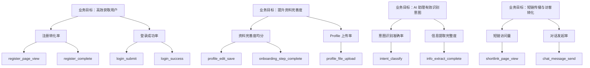
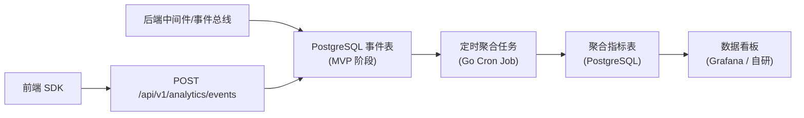

# BabySocial MVP — 数据分析规划

> **关联 PRD**：`docs/prd/PRD-user-auth-20260405.md`、`docs/prd/PRD-user-profile-20260405.md`、`docs/prd/PRD-visitor-intent-20260405.md`
> **规划时间**：2026-04-06
> **规划者**：data-analyst Agent

---

## 目录

- [业务目标与指标映射](#业务目标与指标映射)
- [埋点方案](#埋点方案)
  - [事件命名规范](#事件命名规范)
  - [用户标识方案](#用户标识方案)
  - [埋点事件清单](#埋点事件清单)
    - [用户注册与登录模块](#用户注册与登录模块)
    - [个人主页展示模块](#个人主页展示模块)
    - [访客意图识别聊天助手模块](#访客意图识别聊天助手模块)
    - [异常与性能事件（全局）](#异常与性能事件全局)
- [指标体系](#指标体系)
  - [L1 业务指标](#l1-业务指标)
  - [L2 功能指标](#l2-功能指标)
  - [L3 技术指标](#l3-技术指标)
- [数据看板](#数据看板)
  - [产品看板](#产品看板)
  - [运营看板](#运营看板)
  - [技术看板](#技术看板)
- [技术实现建议](#技术实现建议)
  - [前端埋点实现](#前端埋点实现)
  - [后端埋点实现](#后端埋点实现)
  - [数据存储方案](#数据存储方案)
- [数据隐私合规](#数据隐私合规)
- [A/B 测试方案](#ab-测试方案)
- [实施优先级](#实施优先级)

---

## 业务目标与指标映射

| 业务目标 | 北极星指标 | 过程指标 | 健康指标 |
|----------|-----------|----------|----------|
| 高效获取用户，构建身份体系 | 注册转化率 >= 60% | 注册流程完成时长、漏斗各步骤流失率、验证码验证成功率 | 账号锁定率、验证码发送失败率、接口 P99 响应时间 |
| 提升用户资料完善度，夯实 AI 助理知识库 | 资料完善度均分 >= 60 分 | 注册引导完成率、Profile 文件上传率、完善度评分分布 | 主页加载时间、文件上传失败率、摘要生成失败率 |
| 让 AI 助理有效识别访客意图、收集结构化信息 | 意图识别准确率 >= 85% | 对话完成率、平均对话轮次、红线触发率、访客主动离开率 | AI 回复延迟、意图识别调用失败率、状态机异常率 |
| 推动短链外部传播，吸引访客与 AI 助理交互 | 短链访问量（持续增长） | AI 助理对话发起率 >= 40%、主人会话查阅率 >= 80% | 短链解析失败率、AI 首条回复时间 P95 |



---

## 埋点方案

### 事件命名规范

- 格式：`{object}_{action}`
- object：操作对象（如 `page`、`button`、`form`、`message`、`chat`、`profile`）
- action：操作行为（如 `view`、`click`、`submit`、`send`、`upload`、`complete`）
- 全部小写，下划线分隔
- 示例：`register_page_view`、`login_submit`、`chat_message_send`、`profile_file_upload`

### 用户标识方案

| 标识类型 | 生成时机 | 存储位置 | 生命周期 |
|----------|---------|----------|----------|
| 匿名 ID（anonymous_id） | 首次访问页面 | localStorage + Cookie | 浏览器清除前永久有效 |
| 用户 ID（user_id） | 注册成功 / 登录成功 | JWT Token + 服务端 | 账号生命周期 |
| 设备 ID（device_id） | 首次访问（指纹生成） | localStorage | 浏览器清除前永久有效 |
| 会话 ID（session_id） | 每次新会话开始（30分钟无活动则过期） | sessionStorage | 单次会话 |

**ID 关联策略**：用户注册或登录成功时，将当前 `anonymous_id` 与 `user_id` 进行绑定（alias），后续分析中两个 ID 的行为合并为同一用户。服务端在 `POST /api/v1/analytics/events` 接收到携带 `anonymous_id` 和 `user_id` 的事件时，在写入层完成 ID mapping。匿名访客（通过短链访问 AI 聊天的未登录用户）仅使用 `anonymous_id` + `session_id`，不做强关联。

### 埋点事件清单

#### 用户注册与登录模块

| 事件名 | 描述 | 触发时机 | 触发端 | 关联页面/接口 |
|--------|------|----------|--------|--------------|
| register_page_view | 用户访问注册页面 | 注册页面加载完成 | 前端 | /register |
| captcha_challenge_show | 人机校验组件展示 | 邮箱格式校验通过后，人机校验组件渲染 | 前端 | /register |
| captcha_verify_success | 人机校验通过 | 用户完成滑动验证 | 前端 | /register |
| captcha_verify_fail | 人机校验失败 | 用户滑动验证未通过 | 前端 | /register |
| verification_code_send | 验证码发送请求 | 用户点击"发送验证码" | 后端 | POST /api/v1/auth/register/send-code |
| verification_code_send_fail | 验证码发送失败 | 邮件服务发送失败 | 后端 | POST /api/v1/auth/register/send-code |
| verification_code_submit | 验证码提交验证 | 用户输入验证码并提交 | 后端 | POST /api/v1/auth/register/verify-code |
| verification_code_verify_success | 验证码验证成功 | 验证码比对通过 | 后端 | POST /api/v1/auth/register/verify-code |
| verification_code_verify_fail | 验证码验证失败 | 验证码错误或过期 | 后端 | POST /api/v1/auth/register/verify-code |
| password_set_submit | 密码设置提交 | 用户提交密码设置表单 | 前端 | /register |
| register_complete | 注册完成 | 用户账号创建成功，自动登录 | 后端 | POST /api/v1/auth/register |
| register_funnel_drop | 注册流程中途放弃 | 用户离开注册页（beforeunload / 路由切换） | 前端 | /register |
| login_page_view | 用户访问登录页面 | 登录页面加载完成 | 前端 | /login |
| login_submit | 登录表单提交 | 用户点击登录按钮 | 后端 | POST /api/v1/auth/login |
| login_success | 登录成功 | JWT 颁发完成 | 后端 | POST /api/v1/auth/login |
| login_fail | 登录失败 | 邮箱或密码校验不通过 | 后端 | POST /api/v1/auth/login |
| account_locked | 账号被锁定 | 连续5次登录失败触发锁定 | 后端 | POST /api/v1/auth/login |
| token_refresh | Token 刷新请求 | 前端使用 Refresh Token 续期 | 后端 | POST /api/v1/auth/token/refresh |
| token_refresh_fail | Token 刷新失败 | Refresh Token 无效或过期 | 后端 | POST /api/v1/auth/token/refresh |

**`register_page_view` 事件属性**：

| 属性名 | 类型 | 必填 | 示例值 | 说明 |
|--------|------|------|--------|------|
| referrer | string | 否 | "https://google.com" | 来源页面 |
| utm_source | string | 否 | "wechat" | 投放渠道 |
| utm_campaign | string | 否 | "launch_2026" | 投放活动 |

**`register_complete` 事件属性**：

| 属性名 | 类型 | 必填 | 示例值 | 说明 |
|--------|------|------|--------|------|
| user_id | string | 是 | "uuid-xxx" | 新注册用户ID |
| duration_seconds | int | 是 | 120 | 从进入注册页到完成的总秒数 |
| verification_attempts | int | 是 | 1 | 验证码提交次数 |

**`register_funnel_drop` 事件属性**：

| 属性名 | 类型 | 必填 | 示例值 | 说明 |
|--------|------|------|--------|------|
| drop_step | string | 是 | "email_input" | 放弃时所在步骤（email_input / captcha / code_verify / password_set） |
| time_spent_seconds | int | 是 | 35 | 在当前步骤停留的秒数 |

**`login_submit` 事件属性**：

| 属性名 | 类型 | 必填 | 示例值 | 说明 |
|--------|------|------|--------|------|
| remember_me | bool | 是 | true | 是否勾选"记住我" |

**`login_fail` 事件属性**：

| 属性名 | 类型 | 必填 | 示例值 | 说明 |
|--------|------|------|--------|------|
| fail_reason | string | 是 | "invalid_credentials" | 失败原因（invalid_credentials / account_locked / rate_limited） |
| attempt_count | int | 是 | 3 | 当前连续失败次数 |

---

#### 个人主页展示模块

| 事件名 | 描述 | 触发时机 | 触发端 | 关联页面/接口 |
|--------|------|----------|--------|--------------|
| profile_page_view | 个人主页被访问 | 主页加载完成 | 前端 | /profile/{user_id} |
| profile_edit_open | 打开资料编辑页 | 用户点击"编辑资料"按钮 | 前端 | /profile/edit |
| profile_edit_save | 资料编辑保存 | 用户保存资料修改 | 后端 | PUT /api/v1/profile |
| onboarding_start | 注册引导流程开始 | 注册完成后引导页加载 | 前端 | /onboarding |
| onboarding_step_complete | 引导步骤完成 | 用户完成某一引导步骤 | 前端 | /onboarding |
| onboarding_step_skip | 引导步骤跳过 | 用户跳过某一引导步骤 | 前端 | /onboarding |
| onboarding_complete | 引导流程整体完成 | 用户完成所有步骤或点击"完成" | 前端 | /onboarding |
| profile_file_upload | Profile 文件上传 | 用户上传 profile 文件 | 后端 | POST /api/v1/profile/file |
| profile_file_upload_fail | 文件上传失败 | 文件格式/大小校验不通过或上传请求失败 | 后端 | POST /api/v1/profile/file |
| profile_summary_generate | Profile 摘要生成完成 | LLM 异步生成摘要成功 | 后端 | 异步任务 |
| profile_summary_generate_fail | 摘要生成失败 | LLM 调用失败或超时 | 后端 | 异步任务 |
| shortlink_page_view | 短链页面访问 | 访客通过短链打开 AI 聊天页 | 前端 | /profile/ai/{short_id} |
| shortlink_copy | 短链复制 | 用户点击"一键复制"按钮 | 前端 | /profile/{user_id} |
| completeness_score_change | 完善度分数变化 | 用户保存资料后分数更新 | 后端 | PUT /api/v1/profile |
| ai_setting_save | AI 助理接待设置保存 | 主人保存接待设置 | 后端 | PUT /api/v1/ai-setting |
| ai_setting_preview_start | AI 助理预览开始 | 主人进入预览模式 | 前端 | /ai-setting/preview |

**`profile_page_view` 事件属性**：

| 属性名 | 类型 | 必填 | 示例值 | 说明 |
|--------|------|------|--------|------|
| viewed_user_id | string | 是 | "uuid-xxx" | 被访问的用户ID |
| is_self | bool | 是 | true | 是否是本人访问 |
| completeness_score | int | 否 | 65 | 当前完善度分数（仅本人访问时记录） |

**`onboarding_step_complete` 事件属性**：

| 属性名 | 类型 | 必填 | 示例值 | 说明 |
|--------|------|------|--------|------|
| step_number | int | 是 | 2 | 步骤编号（1/2/3） |
| fields_filled | string[] | 是 | ["avatar","nickname"] | 本步骤中实际填写的字段列表 |
| time_spent_seconds | int | 是 | 45 | 本步骤耗时 |

**`profile_file_upload` 事件属性**：

| 属性名 | 类型 | 必填 | 示例值 | 说明 |
|--------|------|------|--------|------|
| file_format | string | 是 | "pdf" | 文件格式（pdf / md） |
| file_size_bytes | int | 是 | 512000 | 文件大小（字节） |

**`shortlink_page_view` 事件属性**：

| 属性名 | 类型 | 必填 | 示例值 | 说明 |
|--------|------|------|--------|------|
| owner_user_id | string | 是 | "uuid-xxx" | 短链对应的主人ID |
| visitor_type | string | 是 | "anonymous" | 访客类型（anonymous / logged_in） |
| referrer | string | 否 | "https://twitter.com" | 来源页面 |

---

#### 访客意图识别聊天助手模块

| 事件名 | 描述 | 触发时机 | 触发端 | 关联页面/接口 |
|--------|------|----------|--------|--------------|
| chat_session_create | 聊天会话创建 | 访客进入短链页面，系统创建会话 | 后端 | POST /api/v1/chat/sessions |
| chat_welcome_send | AI 发送欢迎语 | 会话创建后 AI 主动发送欢迎消息 | 后端 | 系统内部 |
| chat_message_send | 访客发送消息 | 访客在聊天界面发送一条消息 | 后端 | POST /api/v1/chat/messages |
| chat_ai_reply | AI 助理回复 | AI 生成回复并返回给访客 | 后端 | POST /api/v1/chat/messages |
| chat_ai_reply_timeout | AI 回复超时 | AI 回复超过 5 秒未返回 | 后端 | POST /api/v1/chat/messages |
| intent_classify | 意图识别完成 | LLM 完成意图分类 | 后端 | 异步任务 |
| intent_classify_fail | 意图识别失败 | LLM 意图识别调用失败 | 后端 | 异步任务 |
| info_extract_complete | 信息提取完成 | 从对话中成功提取结构化信息 | 后端 | 异步任务 |
| info_extract_fail | 信息提取失败 | LLM 信息提取调用失败 | 后端 | 异步任务 |
| chat_state_transition | 对话状态流转 | 状态机从一个步骤进入下一步骤 | 后端 | 系统内部 |
| chat_redline_trigger | 红线触发 | AI 检测到访客试图获取敏感信息 | 后端 | 系统内部 |
| chat_session_timeout | 会话超时结束 | 5分钟无活跃自动结束会话 | 后端 | 系统内部 |
| chat_session_complete | 会话正常结束 | 对话状态机进入 ENDED 状态 | 后端 | 系统内部 |
| chat_visitor_leave | 访客中途离开 | 访客关闭页面或长时间未互动 | 前端 | /profile/ai/{short_id} |
| owner_session_list_view | 主人查看会话列表 | 主人打开会话管理页面 | 前端 | /sessions |
| owner_session_detail_view | 主人查看会话详情 | 主人点击某条会话查看详情 | 前端 | /sessions/{session_id} |
| owner_session_read | 主人标记会话已读 | 主人查看未读会话 | 后端 | PUT /api/v1/chat/sessions/{id}/read |

**`chat_message_send` 事件属性**：

| 属性名 | 类型 | 必填 | 示例值 | 说明 |
|--------|------|------|--------|------|
| session_id | string | 是 | "uuid-xxx" | 会话ID |
| message_index | int | 是 | 3 | 本会话中的第几条访客消息 |
| message_length | int | 是 | 42 | 消息字符数 |
| owner_user_id | string | 是 | "uuid-xxx" | 短链对应主人的ID |

**`intent_classify` 事件属性**：

| 属性名 | 类型 | 必填 | 示例值 | 说明 |
|--------|------|------|--------|------|
| session_id | string | 是 | "uuid-xxx" | 会话ID |
| intent_type | string | 是 | "COOPERATION" | 识别到的意图枚举值 |
| confidence | float | 是 | 0.87 | 置信度 |
| trigger_message_index | int | 是 | 4 | 触发识别时的消息序号 |
| is_update | bool | 是 | false | 是否为意图更新（非首次识别） |

**`chat_state_transition` 事件属性**：

| 属性名 | 类型 | 必填 | 示例值 | 说明 |
|--------|------|------|--------|------|
| session_id | string | 是 | "uuid-xxx" | 会话ID |
| from_state | string | 是 | "S1_INTENT_DETECTION" | 源状态 |
| to_state | string | 是 | "S2_INTENT_CONFIRM" | 目标状态 |
| trigger_reason | string | 是 | "intent_clear" | 触发原因 |

**`chat_redline_trigger` 事件属性**：

| 属性名 | 类型 | 必填 | 示例值 | 说明 |
|--------|------|------|--------|------|
| session_id | string | 是 | "uuid-xxx" | 会话ID |
| redline_type | string | 是 | "private_contact" | 红线类型（private_contact / tech_stack / project_detail / prompt_leak） |
| visitor_message_snippet | string | 否 | "你用什么框架..." | 访客消息片段（脱敏后，前20字） |

**`info_extract_complete` 事件属性**：

| 属性名 | 类型 | 必填 | 示例值 | 说明 |
|--------|------|------|--------|------|
| session_id | string | 是 | "uuid-xxx" | 会话ID |
| extracted_fields | string[] | 是 | ["intent","background","contact"] | 成功提取的字段列表 |
| field_count | int | 是 | 3 | 提取到的字段数量 |

**`chat_visitor_leave` 事件属性**：

| 属性名 | 类型 | 必填 | 示例值 | 说明 |
|--------|------|------|--------|------|
| session_id | string | 是 | "uuid-xxx" | 会话ID |
| last_state | string | 是 | "S2_INTENT_CONFIRM" | 离开时的对话状态 |
| total_messages | int | 是 | 4 | 访客总消息数 |
| session_duration_seconds | int | 是 | 180 | 会话持续秒数 |

---

#### 异常与性能事件（全局）

| 事件名 | 描述 | 触发时机 | 触发端 | 关联页面/接口 |
|--------|------|----------|--------|--------------|
| api_error | 接口调用报错 | 任意 API 返回 4xx/5xx | 后端 | 全局 |
| page_load | 页面加载性能 | 页面 DOMContentLoaded | 前端 | 全局 |
| js_error | 前端 JS 异常 | window.onerror / unhandledrejection | 前端 | 全局 |
| llm_call | LLM 调用记录 | 每次 LLM API 调用完成 | 后端 | 全局 |

**`api_error` 事件属性**：

| 属性名 | 类型 | 必填 | 示例值 | 说明 |
|--------|------|------|--------|------|
| endpoint | string | 是 | "/api/v1/auth/login" | 接口路径 |
| method | string | 是 | "POST" | HTTP 方法 |
| status_code | int | 是 | 500 | HTTP 状态码 |
| error_message | string | 是 | "internal server error" | 错误信息（脱敏） |
| response_time_ms | int | 是 | 1200 | 响应耗时 |

**`page_load` 事件属性**：

| 属性名 | 类型 | 必填 | 示例值 | 说明 |
|--------|------|------|--------|------|
| page_name | string | 是 | "register" | 页面名称 |
| load_time_ms | int | 是 | 850 | 页面加载耗时 |
| fcp_ms | int | 否 | 320 | First Contentful Paint |
| lcp_ms | int | 否 | 600 | Largest Contentful Paint |

**`llm_call` 事件属性**：

| 属性名 | 类型 | 必填 | 示例值 | 说明 |
|--------|------|------|--------|------|
| call_type | string | 是 | "chat_reply" | 调用类型（chat_reply / intent_classify / info_extract / summary_generate） |
| model | string | 是 | "qwen-plus" | 使用的模型 |
| input_tokens | int | 是 | 1200 | 输入 token 数 |
| output_tokens | int | 是 | 80 | 输出 token 数 |
| latency_ms | int | 是 | 2300 | 调用耗时 |
| success | bool | 是 | true | 是否成功 |

---

## 指标体系

### L1 业务指标

| 指标名称 | 英文标识 | 计算公式 | 统计口径 | 数据来源 | 刷新频率 |
|----------|---------|----------|----------|----------|----------|
| 日活跃用户数 | dau | COUNT(DISTINCT user_id WHERE event_date = today) | 日去重 | login_success, token_refresh | 日 |
| 月活跃用户数 | mau | COUNT(DISTINCT user_id WHERE event_date IN last_30_days) | 月去重 | login_success, token_refresh | 日 |
| 注册转化率 | registration_conversion_rate | COUNT(register_complete) / COUNT(register_page_view) * 100% | 日，按独立用户去重 | register_page_view, register_complete | 日 |
| 登录成功率 | login_success_rate | COUNT(login_success) / COUNT(login_submit) * 100% | 日 | login_submit, login_success | 日 |
| 资料完善度均分 | avg_completeness_score | SUM(completeness_score) / COUNT(users) | 周 | completeness_score_change | 周 |
| 短链日访问量 | daily_shortlink_pv | COUNT(shortlink_page_view WHERE date = today) | 日 | shortlink_page_view | 日 |
| AI 助理对话发起率 | chat_initiation_rate | COUNT(DISTINCT sessions WHERE message_count >= 1) / COUNT(DISTINCT shortlink_page_view.anonymous_id) * 100% | 日 | shortlink_page_view, chat_message_send | 日 |
| 意图识别准确率 | intent_accuracy_rate | COUNT(intent_correct) / COUNT(intent_labeled) * 100% | 周，需人工标注验证 | intent_classify + 人工标注 | 周 |
| 信息提取完整度 | info_extraction_completeness | COUNT(sessions WHERE field_count >= 2) / COUNT(sessions WHERE messages >= 3) * 100% | 周 | info_extract_complete | 周 |
| 主人会话查阅率 | owner_session_view_rate | COUNT(DISTINCT viewed_sessions) / COUNT(total_sessions) * 100% | 周 | owner_session_detail_view, chat_session_complete | 周 |

### L2 功能指标

| 指标名称 | 英文标识 | 计算公式 | 统计口径 | 数据来源 | 刷新频率 |
|----------|---------|----------|----------|----------|----------|
| 注册流程完成时长 | avg_registration_duration | AVG(register_complete.duration_seconds) | 日 | register_complete | 日 |
| 注册漏斗步骤流失率 | registration_funnel_drop_rate | COUNT(register_funnel_drop WHERE drop_step = X) / COUNT(进入该步骤的用户) * 100% | 日 | register_funnel_drop | 日 |
| 验证码首次验证成功率 | first_verify_success_rate | COUNT(register_complete WHERE verification_attempts = 1) / COUNT(register_complete) * 100% | 日 | register_complete | 日 |
| "记住我"勾选率 | remember_me_rate | COUNT(login_submit WHERE remember_me = true) / COUNT(login_submit) * 100% | 周 | login_submit | 周 |
| Token 刷新成功率 | token_refresh_success_rate | COUNT(token_refresh) / (COUNT(token_refresh) + COUNT(token_refresh_fail)) * 100% | 日 | token_refresh, token_refresh_fail | 日 |
| 注册引导完成率 | onboarding_completion_rate | COUNT(onboarding_complete) / COUNT(onboarding_start) * 100% | 日 | onboarding_start, onboarding_complete | 日 |
| 引导步骤跳过率 | onboarding_skip_rate | COUNT(onboarding_step_skip WHERE step = X) / COUNT(进入该步骤) * 100% | 日 | onboarding_step_complete, onboarding_step_skip | 日 |
| Profile 文件上传率 | profile_upload_rate | COUNT(DISTINCT users with upload) / COUNT(total_users) * 100% | 周 | profile_file_upload | 周 |
| 摘要生成成功率 | summary_generation_success_rate | COUNT(profile_summary_generate) / (COUNT(profile_summary_generate) + COUNT(profile_summary_generate_fail)) * 100% | 日 | profile_summary_generate, profile_summary_generate_fail | 日 |
| 资料编辑频次 | profile_edit_frequency | COUNT(profile_edit_save) / COUNT(DISTINCT editing_users) | 月 | profile_edit_save | 月 |
| 完善度评分分布 | completeness_distribution | 各分段用户数占比 | 周 | completeness_score_change | 周 |
| 对话完成率 | chat_completion_rate | COUNT(sessions reaching S5 or S6) / COUNT(total_sessions) * 100% | 周 | chat_state_transition | 周 |
| 平均对话轮次 | avg_chat_rounds | SUM(total_messages) / COUNT(sessions) | 周 | chat_message_send | 周 |
| 红线触发率 | redline_trigger_rate | COUNT(DISTINCT sessions with redline) / COUNT(total_sessions) * 100% | 日 | chat_redline_trigger | 日 |
| 访客主动离开率 | visitor_early_leave_rate | COUNT(chat_visitor_leave WHERE last_state IN ['S0','S1','S2']) / COUNT(total_sessions) * 100% | 周 | chat_visitor_leave | 周 |
| 意图类型分布 | intent_type_distribution | COUNT(sessions WHERE intent = X) / COUNT(total_sessions) * 100% | 月 | intent_classify | 月 |
| 会话未读积压量 | unread_session_backlog | COUNT(sessions WHERE read = false) per owner | 日 | owner_session_read, chat_session_complete | 日 |
| 人机校验通过率 | captcha_pass_rate | COUNT(captcha_verify_success) / (COUNT(captcha_verify_success) + COUNT(captcha_verify_fail)) * 100% | 日 | captcha_verify_success, captcha_verify_fail | 日 |

### L3 技术指标

| 指标名称 | 英文标识 | 计算公式 | 统计口径 | 数据来源 | 刷新频率 |
|----------|---------|----------|----------|----------|----------|
| 注册接口 P99 响应时间 | register_api_p99 | PERCENTILE(api_error/api_success response_time WHERE endpoint = register, 0.99) | 实时 | api_error, 后端日志 | 实时 |
| 登录接口 P99 响应时间 | login_api_p99 | PERCENTILE(response_time WHERE endpoint = login, 0.99) | 实时 | api_error, 后端日志 | 实时 |
| 验证码发送失败率 | verification_send_fail_rate | COUNT(verification_code_send_fail) / COUNT(verification_code_send) * 100% | 实时 | verification_code_send, verification_code_send_fail | 实时 |
| 账号锁定率 | account_lock_rate | COUNT(DISTINCT locked_accounts) / COUNT(DISTINCT login_attempt_accounts) * 100% | 日 | account_locked, login_submit | 日 |
| 个人主页加载 P95 | profile_page_p95 | PERCENTILE(page_load.load_time_ms WHERE page = profile, 0.95) | 实时 | page_load | 实时 |
| 文件上传失败率 | file_upload_fail_rate | COUNT(profile_file_upload_fail) / (COUNT(profile_file_upload) + COUNT(profile_file_upload_fail)) * 100% | 实时 | profile_file_upload, profile_file_upload_fail | 实时 |
| 短链解析失败率 | shortlink_resolve_fail_rate | COUNT(shortlink 404 responses) / COUNT(shortlink requests) * 100% | 实时 | api_error | 实时 |
| AI 首条回复时间 P95 | ai_first_reply_p95 | PERCENTILE(llm_call.latency_ms WHERE call_type = chat_reply AND is_first = true, 0.95) | 实时 | llm_call | 实时 |
| AI 回复平均延迟 | ai_reply_avg_latency | AVG(llm_call.latency_ms WHERE call_type = chat_reply) | 实时 | llm_call | 实时 |
| 意图识别调用失败率 | intent_classify_fail_rate | COUNT(intent_classify_fail) / (COUNT(intent_classify) + COUNT(intent_classify_fail)) * 100% | 实时 | intent_classify, intent_classify_fail | 实时 |
| 信息提取调用失败率 | info_extract_fail_rate | COUNT(info_extract_fail) / (COUNT(info_extract_complete) + COUNT(info_extract_fail)) * 100% | 实时 | info_extract_complete, info_extract_fail | 实时 |
| 对话状态机异常率 | state_machine_error_rate | COUNT(unexpected transitions) / COUNT(total transitions) * 100% | 实时 | chat_state_transition | 实时 |
| 会话超时率 | session_timeout_rate | COUNT(chat_session_timeout) / COUNT(total_sessions) * 100% | 日 | chat_session_timeout | 日 |
| LLM 日调用量 | daily_llm_calls | COUNT(llm_call WHERE date = today) | 日 | llm_call | 日 |
| LLM 日 Token 消耗 | daily_token_usage | SUM(llm_call.input_tokens + llm_call.output_tokens WHERE date = today) | 日 | llm_call | 日 |
| 前端 JS 错误率 | frontend_error_rate | COUNT(js_error) / COUNT(page_load) * 100% | 日 | js_error, page_load | 日 |

---

## 数据看板

### 产品看板

**目标受众**：产品经理
**刷新策略**：每日凌晨 2:00 自动刷新，支持手动刷新

| 图表名称 | 图表类型 | 数据指标 | 维度 | 筛选条件 |
|----------|---------|----------|------|----------|
| 核心 KPI 概览 | 数值卡片（6 个） | DAU、MAU、注册转化率、登录成功率、短链日PV、对话发起率 | - | 日期范围 |
| 注册漏斗 | 漏斗图 | 注册页访问 -> 人机校验通过 -> 验证码验证成功 -> 注册完成 | 日 | 日期范围、渠道 |
| 注册转化率趋势 | 折线图 | 注册转化率 | 日 / 周 | 日期范围 |
| 资料完善度分布 | 饼图 | 0-40% / 41-70% / 71-100% 各段用户占比 | - | 日期范围 |
| 注册引导漏斗 | 漏斗图 | 开始引导 -> Step1 完成 -> Step2 完成 -> Step3 完成 -> 引导完成 | 日 | 日期范围 |
| Profile 上传率趋势 | 折线图 | Profile 文件上传率 | 周 | 日期范围 |
| 意图类型分布 | 饼图 | 各意图类型占比 | - | 日期范围 |
| 对话漏斗 | 漏斗图 | 短链访问 -> 发送首条消息 -> 到达背景收集 -> 到达收尾 | 日 | 日期范围 |
| 信息提取完整度趋势 | 折线图 | 信息提取完整度 | 周 | 日期范围 |
| 会话未读积压 Top 10 | 表格 | 用户ID、未读数、最后来访时间 | - | - |

### 运营看板

**目标受众**：运营
**刷新策略**：每日凌晨 2:00 自动刷新，支持手动刷新

| 图表名称 | 图表类型 | 数据指标 | 维度 | 筛选条件 |
|----------|---------|----------|------|----------|
| 用户增长趋势 | 折线图 | 日注册量、累计注册量 | 日 / 周 / 月 | 日期范围 |
| DAU / MAU 趋势 | 折线图 | DAU、MAU | 日 / 周 | 日期范围 |
| 注册渠道分布 | 饼图 | 各 utm_source 的注册量占比 | - | 日期范围 |
| "记住我"勾选率趋势 | 折线图 | 记住我勾选率 | 周 | 日期范围 |
| 短链访问来源 Top 10 | 表格 | referrer 域名、访问量、对话发起率 | - | 日期范围 |
| 短链访问热力图 | 热力图 | 短链访问量 | 小时 x 星期 | 日期范围 |
| 对话发起率趋势 | 折线图 | AI 助理对话发起率 | 日 | 日期范围 |
| 红线触发率趋势 | 折线图 | 红线触发率 | 日 | 日期范围 |
| 访客意图类型趋势 | 堆叠面积图 | 各意图类型的会话数量 | 日 | 日期范围 |
| 高价值访客明细 | 表格 | 会话ID、意图类型、提取信息摘要、来访时间 | - | 意图类型=INVESTMENT/MEDIA/COOPERATION |

### 技术看板

**目标受众**：开发 / SRE
**刷新策略**：实时（每 1 分钟自动刷新）

| 图表名称 | 图表类型 | 数据指标 | 维度 | 筛选条件 |
|----------|---------|----------|------|----------|
| 接口健康状态 | 数值卡片（4个） | 注册接口P99、登录接口P99、AI回复P95、文件上传失败率 | - | 近 1 小时 |
| 接口响应时间趋势 | 折线图 | P50 / P95 / P99 响应时间 | 分钟 | 接口名称、日期范围 |
| 错误率趋势 | 折线图 | 验证码发送失败率、意图识别失败率、信息提取失败率、状态机异常率 | 分钟 | 日期范围 |
| LLM 调用概览 | 数值卡片 | 日调用量、日 Token 消耗、平均延迟、失败率 | - | 日期范围 |
| LLM 调用延迟分布 | 直方图 | llm_call.latency_ms | 按 call_type 分组 | 日期范围 |
| LLM Token 消耗趋势 | 折线图 | 日 Token 消耗量（按类型分） | 日 | 日期范围、模型 |
| 前端页面加载性能 | 表格 | 各页面 P50/P95 加载时间、FCP、LCP | 按页面分组 | 日期范围 |
| 账号锁定趋势 | 折线图 | 账号锁定率 | 日 | 日期范围 |
| 前端 JS 错误 Top 10 | 表格 | 错误消息、出现次数、影响页面 | - | 近 24 小时 |
| 短链解析失败明细 | 表格 | 请求 URL、时间、来源 IP | - | 近 24 小时 |

---

## 技术实现建议

### 前端埋点实现

**推荐方案**：自研轻量埋点 SDK（`@babysocial/analytics`），MVP 阶段不引入第三方 SDK，保持可控性和隐私合规。后续数据量增长后可对接 Mixpanel、Amplitude 等平台。

**埋点植入方式**：
- 全局自动采集：页面浏览（`page_load`、`page_view`）通过 React Router 的 `useLocation` Hook 自动上报；JS 异常通过 `window.addEventListener('error')` 全局捕获
- 业务手动埋点：通过 `useAnalytics()` Hook 在组件中手动调用 `track(eventName, properties)`

**上报策略**：
- 缓存方式：内存队列 + `localStorage` 持久化（防止页面关闭丢失）
- 批量上报间隔：每 5 秒或队列满 10 条时触发上报（取先到者）
- 失败重试策略：指数退避重试，最多 3 次；页面关闭前通过 `navigator.sendBeacon` 上报剩余事件

**代码示例**：
```typescript
// hooks/useAnalytics.ts
import { useCallback } from 'react';
import { analyticsClient } from '@/services/analytics';

export function useAnalytics() {
  const track = useCallback((event: string, properties?: Record<string, unknown>) => {
    analyticsClient.track(event, {
      ...properties,
      timestamp: Date.now(),
      session_id: analyticsClient.getSessionId(),
    });
  }, []);

  return { track };
}

// 使用示例 - 注册页面
function RegisterPage() {
  const { track } = useAnalytics();

  useEffect(() => {
    track('register_page_view', { referrer: document.referrer });
  }, []);

  const handleCodeSubmit = (code: string) => {
    // 提交验证码时，后端负责记录验证结果事件
    api.verifyCode(code);
  };
}
```

### 后端埋点实现

**推荐方案**：基于 Go 中间件 + 事件总线（Event Bus）实现。HTTP 中间件自动采集 API 调用指标（响应时间、状态码）；业务事件通过领域事件总线发布，异步写入分析数据库。

**采集接口**：
- 路径：`POST /api/v1/analytics/events`
- 请求格式：
```json
{
  "events": [
    {
      "event_name": "register_page_view",
      "timestamp": "2026-04-06T10:30:00Z",
      "anonymous_id": "anon-uuid-xxx",
      "user_id": null,
      "session_id": "session-uuid-xxx",
      "properties": {
        "referrer": "https://google.com",
        "utm_source": "wechat"
      },
      "context": {
        "user_agent": "Mozilla/5.0...",
        "ip": "masked",
        "locale": "zh-CN",
        "screen_resolution": "1920x1080"
      }
    }
  ]
}
```

**数据管道**：


**MVP 简化方案**：MVP 阶段不引入消息队列，直接写入 PostgreSQL 的 `analytics_events` 表。聚合指标通过 Go 定时任务（每小时）从原始事件表计算并写入 `analytics_metrics` 表。后续数据量增长后可引入 Kafka + ClickHouse。

### 数据存储方案

| 数据类型 | 存储方案 | 保留期限 | 预估数据量（日） |
|----------|---------|----------|----------------|
| 原始事件 | PostgreSQL `analytics_events` 表（分区表，按月分区） | 90 天（过期后归档或删除） | MVP 阶段：~10,000 条/日 |
| 聚合指标 | PostgreSQL `analytics_metrics` 表 | 永久保留 | ~500 条/日（每个指标 * 每个维度组合） |
| 用户画像 | PostgreSQL `user_profiles` + `user_analytics_summary` 表 | 账号生命周期 | 随用户数增长 |
| LLM 调用日志 | PostgreSQL `llm_call_logs` 表 | 30 天 | ~5,000 条/日（对话量依赖短链传播） |

---

## 数据隐私合规

### 敏感数据分类

| 数据字段 | 敏感等级 | 采集方式 | 存储方式 | 合规要求 |
|----------|---------|----------|----------|----------|
| 用户邮箱 | 高 | 注册时收集 | bcrypt 加密（密码）/ 明文（邮箱，用于登录） | 个保法第26条：需用户同意；GDPR Art.6 |
| 用户密码 | 高 | 注册时收集 | bcrypt 加密（cost >= 12） | 禁止明文存储，禁止日志输出 |
| 访客 IP 地址 | 中 | 自动采集 | 脱敏存储（仅保留前三段，如 192.168.1.xxx） | GDPR 视为个人数据；个保法视为个人信息 |
| 访客联系方式 | 高 | 对话中主动提供 | 明文（MVP），后续需加密 | 需明确告知用途；主人侧需保密义务提醒 |
| 对话内容 | 中 | 对话过程自动存储 | 明文存储 | 需隐私政策告知；支持删除 |
| 用户 User-Agent | 低 | 自动采集 | 明文 | 常规采集，无特殊要求 |
| 用户生日 | 中 | 用户主动填写 | 明文（主页仅展示年龄） | 个保法：敏感个人信息；未成年人需额外保护 |
| 地理位置 | 中 | 不主动采集（MVP） | - | 后续若采集需单独授权 |

### 合规检查清单

- [ ] 用户知情同意机制（隐私政策弹窗）——注册前必须展示隐私政策，用户明确同意后方可继续
- [ ] 数据最小化采集原则——仅采集上述列表中明确标注的数据字段，不做冗余采集
- [ ] 敏感数据加密存储——密码使用 bcrypt；IP 地址脱敏；后续联系方式需加密
- [ ] 数据删除接口（Right to be Forgotten）——提供 `DELETE /api/v1/account` 接口，删除用户的全部数据（用户表、资料表、对话记录、分析事件）
- [ ] 数据导出接口（Data Portability）——提供 `GET /api/v1/account/export` 接口，导出用户个人数据（JSON 格式）
- [ ] 未成年人数据保护——生日字段显示年龄限制为 6-120 岁；若检测到未成年用户（< 18岁），对话中需采用简化表达，不收集联系方式
- [ ] 埋点数据不包含原始密码、完整邮箱等——事件属性中禁止携带 password、full_email 等字段
- [ ] LLM 调用不传输用户密码和验证码——发送给 LLM 的 prompt 中不包含任何认证凭据

---

## A/B 测试方案

| 实验名称 | 实验对象 | 分组策略 | 核心指标 | 显著性标准 | 最小样本量 |
|----------|---------|----------|----------|-----------|-----------|
| 注册引导步骤数优化 | 新注册用户 | 50/50 随机分流：A组 3步引导 vs B组 2步引导（合并Step2和Step3） | 引导完成率、资料完善度均分 | p < 0.05，双尾检验 | 每组 500 用户 |
| 注册页 CTA 文案 | 访问注册页的新用户 | 50/50 随机分流：A组"免费注册" vs B组"立即加入" | 注册转化率 | p < 0.05 | 每组 1,000 PV |
| AI 助理欢迎语风格 | 通过短链访问的访客 | 50/50 按 session 分流：A组正式友好风格 vs B组轻松活泼风格 | 对话发起率、对话完成率 | p < 0.05 | 每组 300 会话 |
| 对话漏斗节奏 | AI 助理会话 | 50/50 按 session 分流：A组标准6步流程 vs B组快速4步流程（合并S1+S2、S4跳过） | 信息提取完整度、访客主动离开率 | p < 0.05 | 每组 200 会话 |
| 完善度激励文案 | 完善度 < 60% 的用户 | 50/50 随机分流：A组无提示 vs B组在主页顶部展示激励文案 | 7 日内完善度提升幅度 | p < 0.05 | 每组 300 用户 |

**A/B 测试平台建议**：MVP 阶段自研简易分流逻辑（基于 `user_id` 或 `anonymous_id` 的 hash 取模），实验配置存储在数据库 `ab_experiments` 表中。后续可对接 GrowthBook（开源）或 Unleash 等专业实验平台。

---

## 实施优先级

### P0 — MVP 必须（首版上线前完成）

1. **前端埋点 SDK 基础框架**——`useAnalytics` Hook、事件队列、批量上报、`sendBeacon` 兜底
2. **后端事件采集接口**——`POST /api/v1/analytics/events`，写入 `analytics_events` 表
3. **后端 HTTP 中间件**——自动记录 API 响应时间、状态码
4. **注册模块核心埋点**——`register_page_view`、`register_complete`、`register_funnel_drop`、`verification_code_send`/`send_fail`、`login_submit`、`login_success`、`login_fail`、`account_locked`
5. **个人主页核心埋点**——`profile_page_view`、`shortlink_page_view`、`profile_file_upload`/`upload_fail`、`profile_summary_generate`/`generate_fail`
6. **AI 聊天核心埋点**——`chat_session_create`、`chat_message_send`、`chat_ai_reply`、`intent_classify`/`classify_fail`、`info_extract_complete`/`fail`、`chat_redline_trigger`
7. **LLM 调用日志**——`llm_call` 事件（含 token 计数和延迟）
8. **隐私政策弹窗**——注册前强制展示，获取用户同意
9. **技术看板**——接口 P99 响应时间、LLM 调用监控、错误率告警（可用 Grafana + PostgreSQL）

### P1 — 重要（上线后 1 个月内补齐）

1. **产品看板**——注册漏斗、对话漏斗、意图类型分布、完善度分布
2. **运营看板**——用户增长趋势、短链来源分析、高价值访客明细
3. **聚合指标定时任务**——从原始事件计算 L1/L2 指标写入聚合表
4. **用户标识关联**——`anonymous_id` 与 `user_id` 的 alias 映射表和合并逻辑
5. **引导流程埋点**——`onboarding_start`/`step_complete`/`step_skip`/`complete`
6. **会话管理埋点**——`owner_session_list_view`、`owner_session_detail_view`、`owner_session_read`
7. **性能埋点**——`page_load`（FCP、LCP）、`js_error`
8. **数据删除接口**——`DELETE /api/v1/account`（满足 GDPR / 个保法要求）

### P2 — 后续迭代

1. **A/B 测试框架**——分流逻辑、实验配置管理、结果统计
2. **数据导出接口**——`GET /api/v1/account/export`
3. **IP 地址脱敏**——采集层自动截断 IP 最后一段
4. **ClickHouse 迁移**——当日事件量超过 100,000 条时，将原始事件存储从 PostgreSQL 迁移至 ClickHouse
5. **消息队列引入**——当写入 QPS 超过 PostgreSQL 承载能力时，引入 Kafka 作为缓冲层
6. **第三方平台对接**——视需求对接 Mixpanel / Amplitude 等 SaaS 分析平台
7. **意图识别准确率自动评估**——定期抽样 + 人工标注，自动计算准确率并纳入看板
8. **联系方式加密存储**——对 `ai_chat_extracted_info` 中的联系方式字段进行 AES 加密
