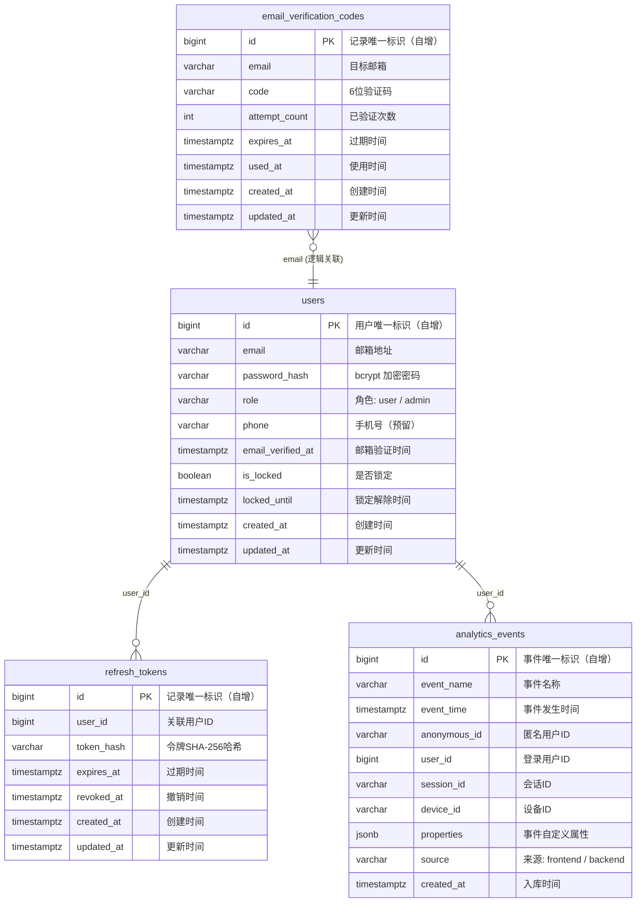

# 用户注册与登录模块 - 数据库设计文档

## 目录

- [1. 文档信息](#1-文档信息)
- [2. 设计概述](#2-设计概述)
  - [2.1 数据库选型](#21-数据库选型)
  - [2.2 命名规范](#22-命名规范)
  - [2.3 通用字段规范](#23-通用字段规范)
- [3. ER 图](#3-er-图)
- [4. 表结构设计](#4-表结构设计)
  - [4.1 users（用户表）](#41-users用户表)
  - [4.2 email_verification_codes（邮箱验证码表）](#42-email_verification_codes邮箱验证码表)
  - [4.3 refresh_tokens（刷新令牌表）](#43-refresh_tokens刷新令牌表)
  - [4.4 analytics_events（埋点事件表）](#44-analytics_events埋点事件表)
- [5. 索引设计](#5-索引设计)
  - [5.1 users](#51-users)
  - [5.2 email_verification_codes](#52-email_verification_codes)
  - [5.3 refresh_tokens](#53-refresh_tokens)
  - [5.4 analytics_events](#54-analytics_events)
  - [5.5 索引设计决策](#55-索引设计决策)
- [6. 数据迁移方案](#6-数据迁移方案)
  - [6.1 迁移文件管理](#61-迁移文件管理)
  - [6.2 迁移文件清单](#62-迁移文件清单)
  - [6.3 迁移 SQL 详情](#63-迁移-sql-详情)
  - [6.4 发布注意事项](#64-发布注意事项)
- [7. 数据归档与清理](#7-数据归档与清理)
- [8. 水平扩展预案](#8-水平扩展预案)
- [9. 设计决策记录](#9-设计决策记录)
- [10. 待确认事项](#10-待确认事项)

---

## 1. 文档信息

| 字段     | 内容                          |
| -------- | ----------------------------- |
| 文档编号 | DB-USER-AUTH-001              |
| 版本     | v1.1                          |
| 作者     | Backend Architect             |
| 创建日期 | 2026-04-06                    |
| 最后更新 | 2026-04-06                    |
| 状态     | 待评审                        |
| 关联架构文档 | ARCH-USER-AUTH-001         |

---

## 2. 设计概述

### 2.1 数据库选型

| 项目 | 选型 | 理由 |
|------|------|------|
| 主数据库 | PostgreSQL 15+ | 项目统一选型，支持 IDENTITY 列、JSON/JSONB、丰富的索引类型，社区活跃 |
| 缓存 | Redis 7+ | 验证码冷却、登录失败计数、IP 频率限制等短时高频场景 |

### 2.2 命名规范

| 对象 | 规范 | 示例 |
|------|------|------|
| 表名 | 小写复数，下划线分隔 | `users`、`refresh_tokens` |
| 字段名 | 小写，下划线分隔 | `created_at`、`user_id` |
| 索引名 | `idx_{表名}_{字段名}` | `idx_users_email` |
| 唯一约束 | `uk_{表名}_{字段名}` | `uk_users_email` |
| 主键约束 | `pk_{表名}` | `pk_users` |
| 外键约束 | 不使用物理外键，通过应用层保证引用完整性 | - |

### 2.3 通用字段规范

以下字段在所有业务表中必须包含：

| 字段 | 类型 | 约束 | 说明 |
|------|------|------|------|
| id | BIGINT | PK, GENERATED ALWAYS AS IDENTITY | 主键，自增 BIGINT（后续可切换为 Snowflake ID） |
| created_at | TIMESTAMP WITH TIME ZONE | NOT NULL, DEFAULT now() | 创建时间，由数据库自动生成 |
| updated_at | TIMESTAMP WITH TIME ZONE | NOT NULL, DEFAULT now() | 更新时间，通过触发器自动维护 |

**不使用物理外键的原因**：

- 避免跨表锁竞争，提升写入性能。
- 方便后续拆库拆表。
- 引用完整性由应用层保证，通过逻辑关联字段上的注释标注关系。

---

## 3. ER 图



---

## 4. 表结构设计

### 4.1 users（用户表）

**用途**：存储用户账号信息，属于 Identity 限界上下文的核心表。承载注册、登录、角色管理等功能。

| 字段名 | 类型 | 约束 | 说明 |
|--------|------|------|------|
| id | BIGINT | PK, GENERATED ALWAYS AS IDENTITY | 用户唯一标识 |
| email | VARCHAR(255) | NOT NULL | 邮箱地址 |
| password_hash | VARCHAR(255) | NOT NULL | bcrypt 加密后的密码（cost=12） |
| role | VARCHAR(20) | NOT NULL, DEFAULT 'user' | 角色：user / admin |
| phone | VARCHAR(20) | NULL | 手机号（预留字段，MVP 不使用） |
| email_verified_at | TIMESTAMPTZ | NULL | 邮箱验证完成时间，NULL 表示未验证 |
| is_locked | BOOLEAN | NOT NULL, DEFAULT false | 账号是否被锁定 |
| locked_until | TIMESTAMPTZ | NULL | 锁定解除时间，NULL 表示未锁定 |
| created_at | TIMESTAMPTZ | NOT NULL, DEFAULT now() | 创建时间 |
| updated_at | TIMESTAMPTZ | NOT NULL, DEFAULT now() | 最后更新时间 |

**关联关系**：

| 关联表 | 关联方式 | 说明 |
|--------|---------|------|
| refresh_tokens | 一对多 | 一个用户可拥有多个 Refresh Token（多设备登录）。逻辑关联，不使用 FK |
| email_verification_codes | 逻辑关联（通过 email） | 验证码通过 email 字段关联，非 user_id |
| analytics_events | 一对多 | 逻辑关联 |

**备注**：

- **邮箱唯一性**：测试阶段不添加 UNIQUE 约束（PRD 3.1.3 要求同一邮箱可反复注册）。通过环境变量 `ALLOW_DUPLICATE_EMAIL` 控制应用层校验逻辑。正式上线前通过迁移脚本添加唯一索引（需先清理重复数据）。
- **role 字段使用 VARCHAR 而非 ENUM**：PostgreSQL ENUM 类型修改不便（添加新值需要 ALTER TYPE），VARCHAR 更灵活，应用层通过代码枚举校验。
- **is_locked + locked_until 分离设计**：`is_locked` 用于快速布尔查询，`locked_until` 记录精确解锁时间。应用层逻辑：若 `is_locked = true` 且 `locked_until > now()`，则账号处于锁定状态。

---

### 4.2 email_verification_codes（邮箱验证码表）

**用途**：存储邮箱验证码记录，用于注册流程的邮箱真实性验证。属于 Identity 限界上下文。

| 字段名 | 类型 | 约束 | 说明 |
|--------|------|------|------|
| id | BIGINT | PK, GENERATED ALWAYS AS IDENTITY | 记录唯一标识 |
| email | VARCHAR(255) | NOT NULL | 目标邮箱 |
| code | VARCHAR(6) | NOT NULL | 6 位数字验证码 |
| attempt_count | INT | NOT NULL, DEFAULT 0 | 已验证尝试次数（最多 5 次） |
| expires_at | TIMESTAMPTZ | NOT NULL | 过期时间（创建时间 + 10 分钟） |
| used_at | TIMESTAMPTZ | NULL | 使用时间，NULL 表示未使用 |
| created_at | TIMESTAMPTZ | NOT NULL, DEFAULT now() | 创建时间 |
| updated_at | TIMESTAMPTZ | NOT NULL, DEFAULT now() | 最后更新时间 |

**关联关系**：

| 关联表 | 关联方式 | 说明 |
|--------|---------|------|
| users | 逻辑关联（email） | 通过 email 字段逻辑关联。注册时用户尚未创建，因此不使用 user_id 关联 |

**备注**：

- 新增了 `attempt_count` 字段（PRD 数据模型概要中未包含），用于记录验证码的验证尝试次数，达到 5 次后该验证码失效。
- 验证码冷却（60 秒内不可重发）通过 Redis 实现，不在此表中记录。
- 该表数据增长较快，需要定期清理过期和已使用的记录。

---

### 4.3 refresh_tokens（刷新令牌表）

**用途**：存储 Refresh Token 的哈希值，用于 Token 刷新和撤销。属于 Identity 限界上下文。

| 字段名 | 类型 | 约束 | 说明 |
|--------|------|------|------|
| id | BIGINT | PK, GENERATED ALWAYS AS IDENTITY | 记录唯一标识 |
| user_id | BIGINT | NOT NULL | 关联用户 ID（逻辑关联 users.id） |
| token_hash | VARCHAR(64) | NOT NULL | Refresh Token 的 SHA-256 哈希值（hex 编码，64 字符） |
| expires_at | TIMESTAMPTZ | NOT NULL | 过期时间（创建时间 + 30 天） |
| revoked_at | TIMESTAMPTZ | NULL | 撤销时间，NULL 表示未撤销 |
| created_at | TIMESTAMPTZ | NOT NULL, DEFAULT now() | 创建时间 |
| updated_at | TIMESTAMPTZ | NOT NULL, DEFAULT now() | 最后更新时间 |

**关联关系**：

| 关联表 | 关联方式 | 说明 |
|--------|---------|------|
| users | 多对一 | 通过 user_id 逻辑关联 users.id。一个用户可有多个 Token（多设备） |

**备注**：

- `token_hash` 存储的是 SHA-256 哈希值，不存储 Refresh Token 明文。客户端持有明文，服务端对比哈希值。
- Token Rotation：每次使用 Refresh Token 刷新时，旧 Token 标记为 `revoked_at = now()`，同时创建新 Token 记录。
- 该表数据增长较快（每次 Token 刷新都会产生新记录），需要定期清理已撤销和已过期的记录。

---

### 4.4 analytics_events（埋点事件表）

**用途**：存储前端和后端上报的埋点事件数据。MVP 阶段作为统一的事件存储，后续可迁移至 ClickHouse 等分析型存储。

| 字段名 | 类型 | 约束 | 说明 |
|--------|------|------|------|
| id | BIGINT | PK, GENERATED ALWAYS AS IDENTITY | 事件唯一标识 |
| event_name | VARCHAR(100) | NOT NULL | 事件名称（如 register_page_view, login_submit） |
| event_time | TIMESTAMPTZ | NOT NULL | 事件发生时间（客户端时间） |
| anonymous_id | VARCHAR(100) | NULL | 匿名用户标识 |
| user_id | BIGINT | NULL | 已登录用户 ID（逻辑关联 users.id） |
| session_id | VARCHAR(100) | NULL | 会话 ID |
| device_id | VARCHAR(100) | NULL | 设备 ID |
| properties | JSONB | NULL | 事件自定义属性（键值对） |
| source | VARCHAR(20) | NOT NULL, DEFAULT 'frontend' | 事件来源：frontend / backend |
| ip_address | VARCHAR(45) | NULL | 客户端 IP（用于分析，脱敏存储） |
| user_agent | VARCHAR(500) | NULL | 客户端 User-Agent |
| created_at | TIMESTAMPTZ | NOT NULL, DEFAULT now() | 入库时间 |

**关联关系**：

| 关联表 | 关联方式 | 说明 |
|--------|---------|------|
| users | 逻辑关联 | 通过 user_id 关联，可为 NULL（匿名事件） |

**备注**：

- 不含 `updated_at` 字段，事件记录写入后不修改。
- `properties` 使用 JSONB 类型，支持灵活的事件属性存储和查询。
- 该表是高增长表，需要严格的归档和清理策略。
- `ip_address` 存储脱敏后的 IP（如末位替换为 x），完整 IP 仅在日志中保留。

#### ClickHouse 迁移预案

MVP 阶段使用 PostgreSQL 存储埋点数据，满足初期需求。当日增数据量超过 10 万行或总量超过 1000 万行时，启动向 ClickHouse 的迁移。

**迁移方案**：

1. **新建 ClickHouse 表**：使用 MergeTree 引擎，按 `event_time` 月分区，按 `event_name` 排序键。
2. **双写阶段**：后端埋点写入改为双写（PostgreSQL + ClickHouse），验证数据一致性。通过配置开关控制是否启用 ClickHouse 写入。
3. **切换读取源**：双写稳定后，将查询和分析的读取源切换到 ClickHouse。
4. **停止 PostgreSQL 写入**：确认 ClickHouse 稳定后，停止向 PostgreSQL analytics_events 表写入。
5. **保留降级方案**：保留 PostgreSQL analytics_events 表结构作为降级方案，出现问题时可快速回切。

**接口抽象**：analytics 的 repository 接口在 domain 层定义（`AnalyticsEventRepository`），PostgreSQL 和 ClickHouse 各自提供实现（`PostgresAnalyticsEventRepository`、`ClickHouseAnalyticsEventRepository`），通过配置切换具体实现，业务逻辑无需改动。

**本期不执行，仅做预案记录。**

---

## 5. 索引设计

### 5.1 users

| 索引名 | 字段 | 类型 | 说明 |
|--------|------|------|------|
| `pk_users` | id | B-tree (PK) | 主键索引 |
| `idx_users_email` | email | B-tree | 登录时按邮箱查询用户。测试阶段为普通索引，正式上线前改为唯一索引 |
| `idx_users_role` | role | B-tree | 管理后台按角色筛选用户 |

### 5.2 email_verification_codes

| 索引名 | 字段 | 类型 | 说明 |
|--------|------|------|------|
| `pk_email_verification_codes` | id | B-tree (PK) | 主键索引 |
| `idx_evc_email_created_at` | (email, created_at DESC) | B-tree | 查询某邮箱最新的验证码记录，用于验证和冷却检查 |

### 5.3 refresh_tokens

| 索引名 | 字段 | 类型 | 说明 |
|--------|------|------|------|
| `pk_refresh_tokens` | id | B-tree (PK) | 主键索引 |
| `uk_refresh_tokens_token_hash` | token_hash | B-tree (UNIQUE) | Token 刷新时按哈希值查找，唯一索引保证不重复 |
| `idx_refresh_tokens_user_id` | user_id | B-tree | 按用户查询所有 Token（用于登出时批量撤销） |

### 5.4 analytics_events

| 索引名 | 字段 | 类型 | 说明 |
|--------|------|------|------|
| `pk_analytics_events` | id | B-tree (PK) | 主键索引 |
| `idx_ae_event_name_event_time` | (event_name, event_time) | B-tree | 按事件名称和时间查询，支持指标计算 |
| `idx_ae_user_id_event_time` | (user_id, event_time) | B-tree | 按用户查询事件历史 |
| `idx_ae_event_time` | event_time | B-tree | 按时间范围查询，支持归档清理 |

### 5.5 索引设计决策

| 表 | 高频查询场景 | 索引方案 | 理由 |
|----|------------|---------|------|
| users | 登录时按 email 查用户 | idx_users_email | 登录是最高频操作，email 查询必须走索引 |
| users | 不为 email 添加 UNIQUE 索引 | 普通 B-tree 索引 | 测试阶段允许重复邮箱（PRD 3.1.3）。正式上线时通过迁移脚本升级为 UNIQUE |
| email_verification_codes | 查询某邮箱最新验证码 | 复合索引 (email, created_at DESC) | 单一 email 索引无法高效获取最新记录，复合索引支持 ORDER BY 优化 |
| refresh_tokens | 刷新时按 token_hash 查找 | uk_refresh_tokens_token_hash (UNIQUE) | Token 刷新是高频操作，hash 查找需要 O(1) 性能。唯一索引同时保证数据完整性 |
| analytics_events | 不建过多索引 | 仅建 3 个查询索引 | 该表写入远多于读取，过多索引影响写入性能。分析查询可容忍稍慢的响应 |

---

## 6. 数据迁移方案

### 6.1 迁移文件管理

| 项目 | 方案 |
|------|------|
| 迁移工具 | golang-migrate |
| 文件位置 | `backend/migrations/` |
| 命名规范 | `{6位序号}_{描述}.up.sql` / `{6位序号}_{描述}.down.sql` |
| 执行方式 | 开发环境手动执行（`migrate -path ... -database ... up`），CI/CD 环境自动执行 |

### 6.2 迁移文件清单

| 序号 | 文件名 | 内容 |
|------|--------|------|
| 000001 | create_users_table | 创建 users 表、基础索引、updated_at 触发器 |
| 000002 | create_email_verification_codes_table | 创建 email_verification_codes 表及索引 |
| 000003 | create_refresh_tokens_table | 创建 refresh_tokens 表及索引 |
| 000004 | create_analytics_events_table | 创建 analytics_events 表及索引 |

### 6.3 迁移 SQL 详情

#### 000001_create_users_table.up.sql

```sql
-- 创建 users 表
CREATE TABLE users (
    id              BIGINT          GENERATED ALWAYS AS IDENTITY PRIMARY KEY,
    email           VARCHAR(255)    NOT NULL,
    password_hash   VARCHAR(255)    NOT NULL,
    role            VARCHAR(20)     NOT NULL DEFAULT 'user',
    phone           VARCHAR(20)     NULL,
    email_verified_at TIMESTAMPTZ   NULL,
    is_locked       BOOLEAN         NOT NULL DEFAULT false,
    locked_until    TIMESTAMPTZ     NULL,
    created_at      TIMESTAMPTZ     NOT NULL DEFAULT now(),
    updated_at      TIMESTAMPTZ     NOT NULL DEFAULT now()
);

-- 创建索引
-- 注意：测试阶段为普通索引，正式上线前需改为唯一索引
CREATE INDEX idx_users_email ON users (email);
CREATE INDEX idx_users_role ON users (role);

-- 创建 updated_at 自动更新触发器
CREATE OR REPLACE FUNCTION update_updated_at_column()
RETURNS TRIGGER AS $$
BEGIN
    NEW.updated_at = now();
    RETURN NEW;
END;
$$ language 'plpgsql';

CREATE TRIGGER trigger_users_updated_at
    BEFORE UPDATE ON users
    FOR EACH ROW
    EXECUTE FUNCTION update_updated_at_column();

-- 添加表注释
COMMENT ON TABLE users IS '用户表 - Identity 限界上下文核心表';
COMMENT ON COLUMN users.email IS '邮箱地址，测试阶段允许重复';
COMMENT ON COLUMN users.password_hash IS 'bcrypt 加密后的密码 (cost=12)';
COMMENT ON COLUMN users.role IS '用户角色: user / admin';
COMMENT ON COLUMN users.phone IS '手机号，预留字段';
COMMENT ON COLUMN users.is_locked IS '账号是否被锁定（连续登录失败5次触发）';
COMMENT ON COLUMN users.locked_until IS '锁定解除时间';
```

#### 000001_create_users_table.down.sql

```sql
DROP TRIGGER IF EXISTS trigger_users_updated_at ON users;
DROP TABLE IF EXISTS users;
-- 不删除 update_updated_at_column 函数和 update_updated_at_column 触发器函数，可能被其他表使用
```

#### 000002_create_email_verification_codes_table.up.sql

```sql
CREATE TABLE email_verification_codes (
    id              BIGINT          GENERATED ALWAYS AS IDENTITY PRIMARY KEY,
    email           VARCHAR(255)    NOT NULL,
    code            VARCHAR(6)      NOT NULL,
    attempt_count   INT             NOT NULL DEFAULT 0,
    expires_at      TIMESTAMPTZ     NOT NULL,
    used_at         TIMESTAMPTZ     NULL,
    created_at      TIMESTAMPTZ     NOT NULL DEFAULT now(),
    updated_at      TIMESTAMPTZ     NOT NULL DEFAULT now()
);

-- 复合索引：查询某邮箱最新验证码
CREATE INDEX idx_evc_email_created_at ON email_verification_codes (email, created_at DESC);

-- updated_at 触发器
CREATE TRIGGER trigger_evc_updated_at
    BEFORE UPDATE ON email_verification_codes
    FOR EACH ROW
    EXECUTE FUNCTION update_updated_at_column();

COMMENT ON TABLE email_verification_codes IS '邮箱验证码表 - 注册流程邮箱验证';
COMMENT ON COLUMN email_verification_codes.attempt_count IS '验证尝试次数，最多5次';
COMMENT ON COLUMN email_verification_codes.used_at IS '使用时间，非NULL表示已使用';
```

#### 000002_create_email_verification_codes_table.down.sql

```sql
DROP TRIGGER IF EXISTS trigger_evc_updated_at ON email_verification_codes;
DROP TABLE IF EXISTS email_verification_codes;
```

#### 000003_create_refresh_tokens_table.up.sql

```sql
CREATE TABLE refresh_tokens (
    id              BIGINT          GENERATED ALWAYS AS IDENTITY PRIMARY KEY,
    user_id         BIGINT          NOT NULL,
    token_hash      VARCHAR(64)     NOT NULL,
    expires_at      TIMESTAMPTZ     NOT NULL,
    revoked_at      TIMESTAMPTZ     NULL,
    created_at      TIMESTAMPTZ     NOT NULL DEFAULT now(),
    updated_at      TIMESTAMPTZ     NOT NULL DEFAULT now()
);

-- 唯一索引：Token 刷新时按哈希值查找
CREATE UNIQUE INDEX uk_refresh_tokens_token_hash ON refresh_tokens (token_hash);

-- 普通索引：按用户查询（登出时批量撤销）
CREATE INDEX idx_refresh_tokens_user_id ON refresh_tokens (user_id);

-- updated_at 触发器
CREATE TRIGGER trigger_refresh_tokens_updated_at
    BEFORE UPDATE ON refresh_tokens
    FOR EACH ROW
    EXECUTE FUNCTION update_updated_at_column();

COMMENT ON TABLE refresh_tokens IS '刷新令牌表 - JWT Refresh Token 管理';
COMMENT ON COLUMN refresh_tokens.user_id IS '关联 users.id（逻辑外键）';
COMMENT ON COLUMN refresh_tokens.token_hash IS 'Refresh Token 的 SHA-256 哈希值 (hex, 64字符)';
COMMENT ON COLUMN refresh_tokens.revoked_at IS '撤销时间，非NULL表示已撤销';
```

#### 000003_create_refresh_tokens_table.down.sql

```sql
DROP TRIGGER IF EXISTS trigger_refresh_tokens_updated_at ON refresh_tokens;
DROP TABLE IF EXISTS refresh_tokens;
```

#### 000004_create_analytics_events_table.up.sql

```sql
CREATE TABLE analytics_events (
    id              BIGINT          GENERATED ALWAYS AS IDENTITY PRIMARY KEY,
    event_name      VARCHAR(100)    NOT NULL,
    event_time      TIMESTAMPTZ     NOT NULL,
    anonymous_id    VARCHAR(100)    NULL,
    user_id         BIGINT          NULL,
    session_id      VARCHAR(100)    NULL,
    device_id       VARCHAR(100)    NULL,
    properties      JSONB           NULL,
    source          VARCHAR(20)     NOT NULL DEFAULT 'frontend',
    ip_address      VARCHAR(45)     NULL,
    user_agent      VARCHAR(500)    NULL,
    created_at      TIMESTAMPTZ     NOT NULL DEFAULT now()
);

-- 查询索引
CREATE INDEX idx_ae_event_name_event_time ON analytics_events (event_name, event_time);
CREATE INDEX idx_ae_user_id_event_time ON analytics_events (user_id, event_time) WHERE user_id IS NOT NULL;
CREATE INDEX idx_ae_event_time ON analytics_events (event_time);

COMMENT ON TABLE analytics_events IS '埋点事件表 - 前端和后端事件统一存储';
COMMENT ON COLUMN analytics_events.event_name IS '事件名称，如 register_page_view, login_submit';
COMMENT ON COLUMN analytics_events.event_time IS '事件发生时间（客户端时间戳）';
COMMENT ON COLUMN analytics_events.properties IS '事件自定义属性（JSONB）';
COMMENT ON COLUMN analytics_events.source IS '事件来源: frontend / backend';
COMMENT ON COLUMN analytics_events.ip_address IS '客户端 IP（脱敏存储）';
```

#### 000004_create_analytics_events_table.down.sql

```sql
DROP TABLE IF EXISTS analytics_events;
```

#### 预留迁移：正式上线前添加邮箱唯一约束

该迁移文件在正式上线前创建，序号待定。

```sql
-- 预留迁移：添加邮箱唯一约束
-- 执行前必须先清理重复邮箱数据

-- Step 1: 查找重复邮箱
-- SELECT email, COUNT(*) FROM users GROUP BY email HAVING COUNT(*) > 1;

-- Step 2: 清理重复数据（保留最新记录）
-- DELETE FROM users a USING users b
-- WHERE a.email = b.email AND a.created_at < b.created_at;

-- Step 3: 将普通索引替换为唯一索引
-- DROP INDEX idx_users_email;
-- CREATE UNIQUE INDEX uk_users_email ON users (email);
```

### 6.4 发布注意事项

1. **迁移执行顺序**：严格按序号顺序执行。`000001` 中创建的 `update_updated_at_column` 函数被后续表复用。
2. **回滚策略**：每个 up 迁移都有对应的 down 迁移。回滚时反向执行。生产环境回滚前需备份数据。
3. **大表迁移**：MVP 阶段数据量小，无需特殊处理。正式上线后如需对 `analytics_events` 等大表做 DDL 变更，建议使用 `CREATE INDEX CONCURRENTLY` 避免锁表。
4. **邮箱唯一约束迁移**：需在正式上线前专项执行，先清理测试数据中的重复邮箱，再添加唯一索引。该操作需在低峰期执行。

---

## 7. 数据归档与清理

| 表 | 增长预估（日） | 归档策略 | 保留周期 | 清理方式 |
|----|--------------|---------|---------|---------|
| users | MVP 阶段极低（<100 行/日） | 不归档，长期保留 | 永久 | 无 |
| email_verification_codes | 约等于注册量（<100 行/日） | 定期删除已使用和过期记录 | 保留 7 天 | 每日定时任务：`DELETE FROM email_verification_codes WHERE (used_at IS NOT NULL OR expires_at < now()) AND created_at < now() - INTERVAL '7 days'` |
| refresh_tokens | 约等于登录量（<200 行/日） | 定期删除已撤销和过期记录 | 保留 30 天 | 每日定时任务：`DELETE FROM refresh_tokens WHERE (revoked_at IS NOT NULL OR expires_at < now()) AND created_at < now() - INTERVAL '30 days'` |
| analytics_events | MVP 阶段 <1000 行/日，正式运营后可能增长至数万/日 | 定期归档到冷存储（后续迭代），当前仅清理 | 保留 90 天 | 每日定时任务：`DELETE FROM analytics_events WHERE created_at < now() - INTERVAL '90 days'` |

**清理任务实现**：MVP 阶段通过 Go 应用内的定时任务（`time.Ticker`）实现。后续可迁移至独立的调度系统（如 cron job）。

---

## 8. 水平扩展预案

MVP 阶段不做分表，单表 PostgreSQL 完全满足需求。以下为后续数据量增长时的扩展预案。

### 8.1 users 表分表方案

**触发条件**：当 users 表数据量达到千万级时，考虑水平分表。

**分表策略**：按 `user_id` 哈希取模（如 `user_id % 16`），将数据分散到 16 张分片表中。

**前置准备（已完成）**：

- 主键使用 BIGINT 类型，天然兼容 Snowflake ID（64-bit 有序分布式 ID）。
- 切换为 Snowflake ID 后，ID 生成不再依赖数据库自增序列，支持多节点独立生成。

**分表时需注意的问题**：

- **email 唯一性约束**：分表后无法通过单表 UNIQUE 索引保证全局唯一性。需改为全局唯一性校验方案：
  - 方案 A：引入 email 到 user_id 的映射表（独立单表），注册时先查映射表判重，再写入分片表。
  - 方案 B：使用分布式锁（如 Redis SETNX）在注册时锁定 email，完成后释放。
- **跨分片查询**：按 email 查询用户需要先通过映射表定位分片，避免广播查询。

**中间件选择方向**：

- **应用层分片**：在 Go 代码中实现路由逻辑（根据 user_id 哈希选择数据源），灵活可控，适合中等规模。
- **数据库中间件**：使用 Citus（PostgreSQL 原生分布式扩展），对应用透明，适合大规模场景。

---

## 9. 设计决策记录

| 编号 | 决策 | 理由 | 被否决的备选方案 |
|------|------|------|----------------|
| DB-DR-01 | 不使用物理外键约束 | 避免跨表锁竞争，提升写入并发性能；方便后续拆库拆表；应用层保证引用完整性已足够 | 使用物理外键：强一致性保证，但 DELETE/UPDATE 时的级联锁定影响性能，且跨库后无法使用 |
| DB-DR-02 | role 使用 VARCHAR 而非 PostgreSQL ENUM 类型 | ENUM 修改（添加新角色）需要 `ALTER TYPE`，在大表上可能锁表。VARCHAR 更灵活，应用层枚举校验即可 | PostgreSQL ENUM：数据库层面保证值域，但修改困难 |
| DB-DR-03 | 验证码表新增 attempt_count 字段 | PRD 要求验证码最多验证 5 次，需要在数据库层面记录尝试次数。仅通过 Redis 记录不够可靠（Redis 重启可能丢失） | 仅用 Redis 记录尝试次数：更快但不持久。使用独立的 verification_attempts 表：过度设计 |
| DB-DR-04 | refresh_tokens.token_hash 使用 SHA-256 而非 bcrypt | Refresh Token 是随机生成的高熵字符串（64 字节），不需要 bcrypt 的慢哈希防暴力破解。SHA-256 计算快，查询时对比效率高 | bcrypt：对于随机高熵 Token 是过度防护，且每次查询都需要遍历比对（bcrypt 无法建索引进行精确匹配） |
| DB-DR-05 | analytics_events.properties 使用 JSONB | 不同事件有不同的属性，固定列无法满足。JSONB 支持索引和查询操作符（`@>`, `->>` 等） | 固定列：每种事件属性都加列，表结构膨胀。TEXT 存 JSON 字符串：无法利用 PostgreSQL 的 JSON 查询能力 |
| DB-DR-06 | analytics_events 表的 user_id 索引使用部分索引（WHERE user_id IS NOT NULL） | 大量匿名事件的 user_id 为 NULL，对 NULL 值建索引浪费空间。部分索引仅索引有值的行，更高效 | 普通索引：包含 NULL 值，索引体积大。不建索引：按用户查事件时全表扫描 |
| DB-DR-07 | 主键使用 BIGINT 自增而非 UUID v4 | 索引性能：BIGINT 顺序写入避免 B-tree 页分裂；存储空间减半（8 字节 vs 16 字节）；B-tree 缓存命中率更高。后续如需分布式 ID，可切换为 Snowflake ID（仍为 BIGINT，64-bit 有序），无需变更列类型 | UUID v4：随机写入导致 B-tree 页分裂严重，索引膨胀快；占用空间大（16 字节）；JOIN 和 WHERE 比较性能低于整型 |

---

## 10. 待确认事项

| 编号 | 问题 | 影响范围 |
|------|------|---------|
| ~~DB-Q-01~~ | ~~正式上线前清理重复邮箱数据的策略：保留最新记录还是最早记录？是否需要合并关联数据？~~ **已确认：保留最新记录，不合并关联数据。清理 SQL 示例：`DELETE FROM users WHERE id NOT IN (SELECT MAX(id) FROM users GROUP BY email)`，清理前需备份。** | 邮箱唯一约束迁移 |
| ~~DB-Q-02~~ | ~~analytics_events 表在数据量增长后是否需要分区（如按 event_time 月分区）？~~ **已确认：MVP 阶段不分区。大数据量场景直接迁移到 ClickHouse（参考 4.4 节 ClickHouse 迁移预案），而非在 PostgreSQL 上做分区。** | 长期存储性能 |
| ~~DB-Q-03~~ | ~~管理员初始账号是否通过迁移脚本插入？如是，初始邮箱和密码如何管理？~~ **已确认：通过迁移脚本插入，初始邮箱和密码通过环境变量注入，禁止硬编码。** | 初始化流程 |
| ~~DB-Q-04~~ | ~~数据库备份策略（全量备份频率、增量备份、保留周期）~~ **已确认：采用增量备份策略。MVP 阶段使用 PostgreSQL WAL 归档实现持续增量备份（`archive_mode=on`），每日一次基础备份（`pg_basebackup`），WAL 日志实时归档。备份保留 30 天。可使用 pgBackRest 或 Barman 管理备份生命周期。** | 运维 |

---

*本文档版本 v1.1，如有修改请更新版本号并记录变更原因。*
