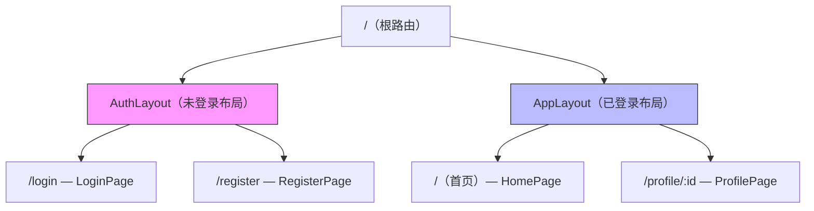
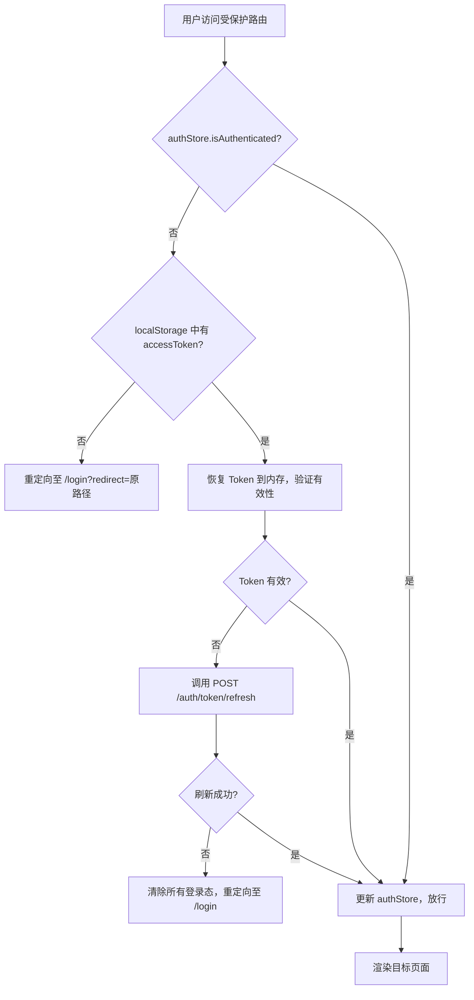
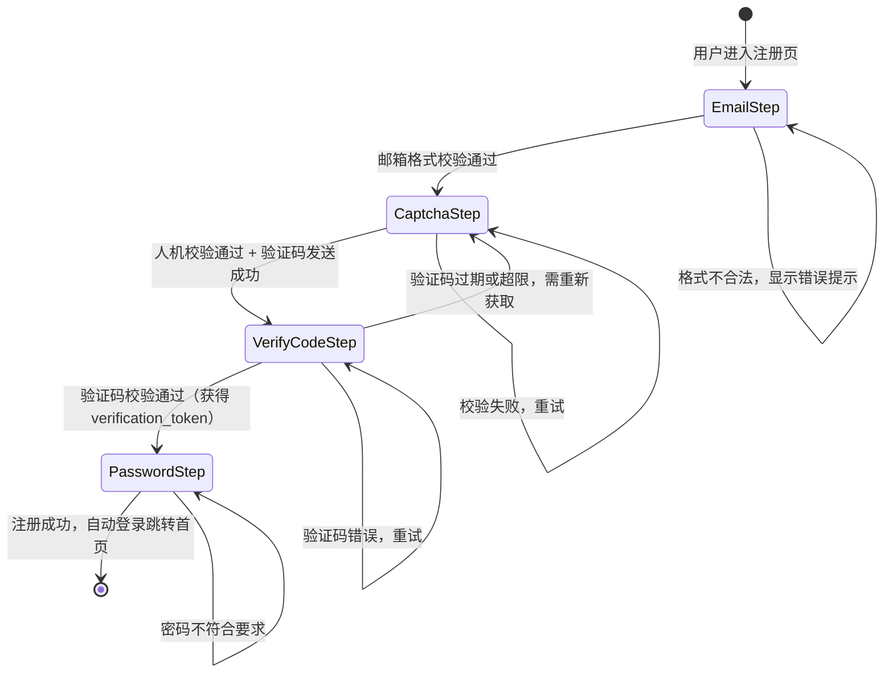
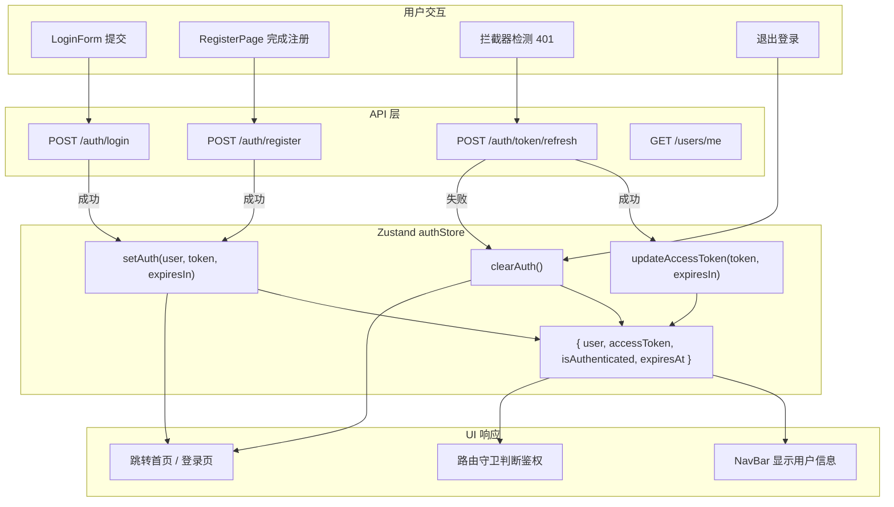
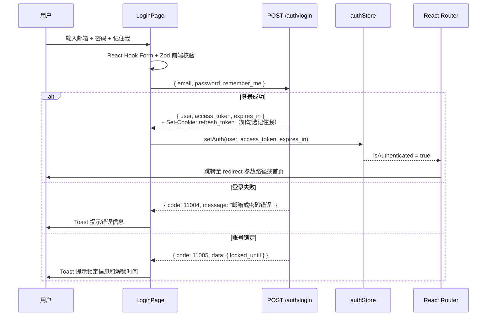
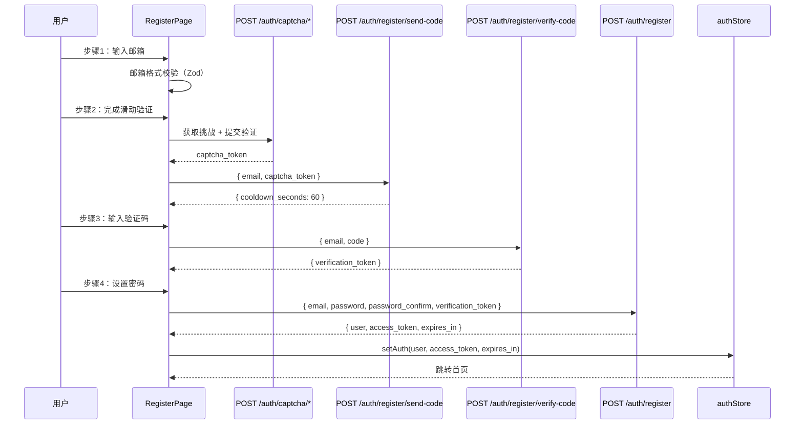
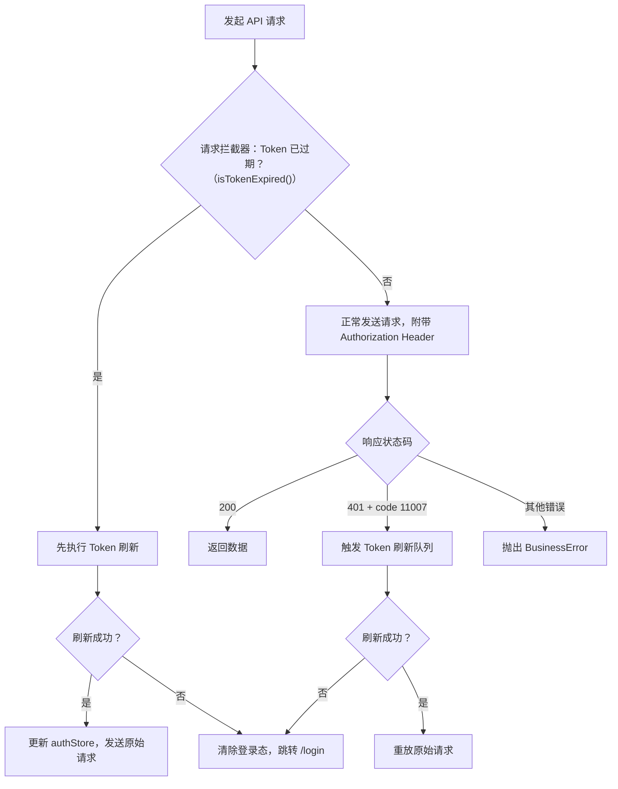
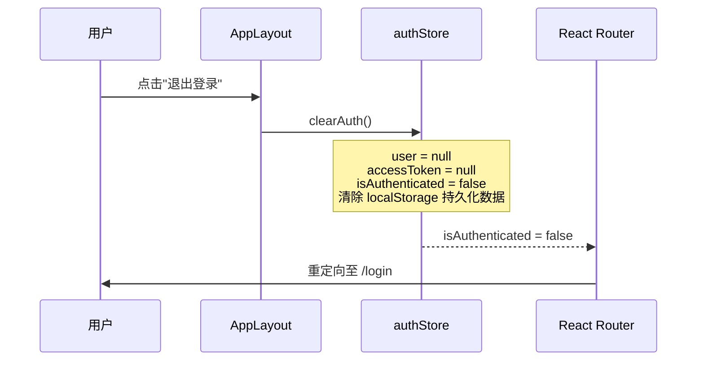
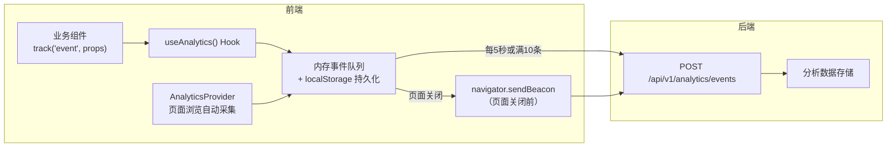
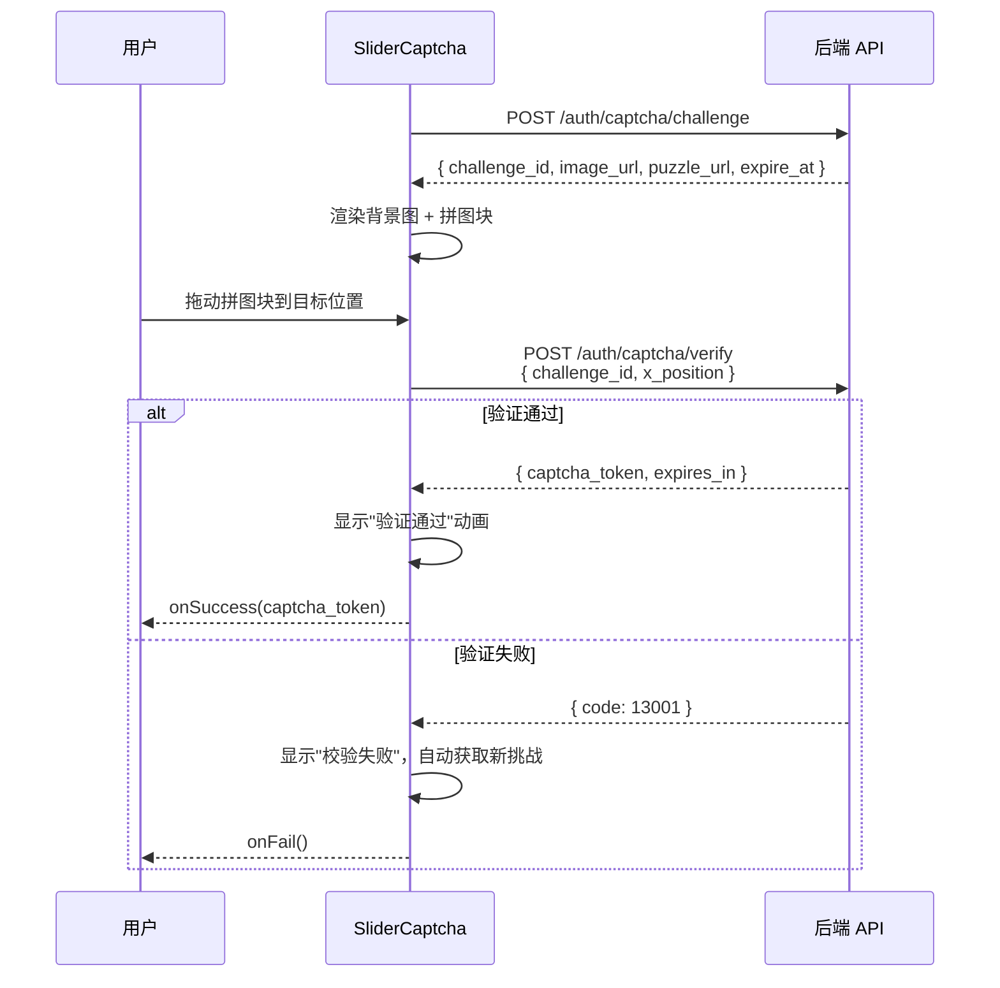

# 用户注册与登录模块 - 前端架构设计

## 目录

- [1. 文档信息](#1-文档信息)
- [2. 设计概述](#2-设计概述)
  - [2.1 技术选型](#21-技术选型)
  - [2.2 工程规范](#22-工程规范)
- [3. 路由设计](#3-路由设计)
  - [3.1 路由结构](#31-路由结构)
  - [3.2 路由守卫](#32-路由守卫)
- [4. 组件架构](#4-组件架构)
  - [4.1 组件分层策略](#41-组件分层策略)
  - [4.2 组件树](#42-组件树)
  - [4.3 注册流程组件拆分](#43-注册流程组件拆分)
  - [4.4 登录页面组件拆分](#44-登录页面组件拆分)
  - [4.5 通用组件清单](#45-通用组件清单)
- [5. 状态管理](#5-状态管理)
  - [5.1 方案选型](#51-方案选型)
  - [5.2 全局状态定义](#52-全局状态定义)
  - [5.3 局部状态](#53-局部状态)
  - [5.4 数据流图](#54-数据流图)
- [6. API 层设计](#6-api-层设计)
  - [6.1 请求封装](#61-请求封装)
  - [6.2 拦截器设计](#62-拦截器设计)
  - [6.3 Token 刷新队列](#63-token-刷新队列)
  - [6.4 TypeScript 接口定义](#64-typescript-接口定义)
- [7. 认证与鉴权](#7-认证与鉴权)
  - [7.1 Token 管理](#71-token-管理)
  - [7.2 登录流程](#72-登录流程)
  - [7.3 注册自动登录流程](#73-注册自动登录流程)
  - [7.4 Token 刷新机制](#74-token-刷新机制)
  - [7.5 登出流程](#75-登出流程)
  - [7.6 "记住我"实现](#76-记住我实现)
- [8. 前端埋点实现](#8-前端埋点实现)
  - [8.1 埋点架构](#81-埋点架构)
  - [8.2 useAnalytics Hook](#82-useanalytics-hook)
  - [8.3 页面浏览自动采集](#83-页面浏览自动采集)
  - [8.4 注册登录模块埋点事件](#84-注册登录模块埋点事件)
- [9. 错误处理](#9-错误处理)
  - [9.1 全局错误边界](#91-全局错误边界)
  - [9.2 API 错误处理](#92-api-错误处理)
  - [9.3 表单验证错误处理](#93-表单验证错误处理)
  - [9.4 用户反馈机制](#94-用户反馈机制)
- [10. 人机校验](#10-人机校验)
  - [10.1 实现方案](#101-实现方案)
  - [10.2 与后端接口对接](#102-与后端接口对接)
- [11. 性能与加载策略](#11-性能与加载策略)
  - [11.1 代码分割](#111-代码分割)
  - [11.2 懒加载](#112-懒加载)
  - [11.3 缓存策略](#113-缓存策略)
- [12. 目录结构](#12-目录结构)
- [13. 设计决策记录](#13-设计决策记录)
- [14. 待确认事项](#14-待确认事项)

---

## 1. 文档信息

| 字段     | 内容                          |
| -------- | ----------------------------- |
| 文档编号 | FE-ARCH-USER-AUTH-001         |
| 版本     | v1.0                          |
| 作者     | Frontend Architect            |
| 创建日期 | 2026-04-06                    |
| 最后更新 | 2026-04-06                    |
| 状态     | 待评审                        |
| 关联 PRD | PRD-USER-AUTH-001             |
| 关联后端架构 | ARCH-USER-AUTH-001        |
| 关联 API 契约 | CONTRACT-USER-AUTH-001   |

---

## 2. 设计概述

本文档定义 BabySocial 平台"用户注册与登录"模块的前端架构设计，覆盖技术选型、路由设计、组件架构、状态管理、API 层封装、认证流程、埋点实现、错误处理和人机校验方案。

核心设计理念：

- **类型安全**：所有 API 请求和响应均定义 TypeScript 接口，与后端 API 契约严格对齐。
- **分层清晰**：页面组件、业务组件、通用组件三层分离，职责明确。
- **认证健壮**：Access Token 内存存储 + Refresh Token HttpOnly Cookie，自动刷新机制覆盖并发场景。
- **可观测**：自研轻量埋点 SDK，自动采集页面浏览事件，手动埋点覆盖注册漏斗各步骤。
- **渐进增强**：MVP 阶段聚焦邮箱注册和密码登录，架构层面预留第三方登录和手机号注册扩展点。

### 2.1 技术选型

| 类别 | 选型 | 版本 | 理由 |
|------|------|------|------|
| 框架 | React | 18.3.x | 生态成熟，函数组件 + Hooks 模式契合项目规范，Concurrent Features 支持未来性能优化 |
| 语言 | TypeScript | 5.4.x | 项目强制要求，类型安全保障 API 契约对齐和重构安全性 |
| 构建工具 | Vite | 5.x | 开发服务器启动快（ESM 原生支持），HMR 体验优于 CRA；生产构建使用 Rollup，tree-shaking 效果好 |
| 路由 | React Router | 6.x | React 生态标准路由方案，支持嵌套路由、数据路由（loader/action）、懒加载 |
| 状态管理 | Zustand | 4.x | 轻量无样板代码，TypeScript 支持好，不需要 Provider 包裹，适合中小型项目 |
| HTTP 客户端 | Axios | 1.7.x | 拦截器机制成熟，支持请求/响应拦截、取消请求、自动 JSON 转换；Token 刷新队列实现方便 |
| UI 组件库 | Ant Design | 5.x | 组件丰富，表单/消息提示/模态框等开箱即用，与 React 18 兼容，国际化支持好 |
| CSS 方案 | CSS Modules | - | 项目规范推荐，局部作用域避免样式冲突，无额外运行时开销，Vite 原生支持 |
| 表单管理 | React Hook Form | 7.x | 性能优秀（非受控组件），与 TypeScript 深度集成，验证器可组合 |
| 表单校验 | Zod | 3.x | TypeScript-first 的 schema 验证库，可同时生成类型定义和运行时校验逻辑 |

### 2.2 工程规范

| 规范项 | 方案 |
|--------|------|
| 代码格式化 | Prettier（配置详见 `.prettierrc`：printWidth: 100, singleQuote: true, trailingComma: 'all'） |
| 代码检查 | ESLint（@typescript-eslint 规则集 + eslint-plugin-react-hooks） |
| 提交检查 | husky + lint-staged（commit 前自动执行 ESLint 和 Prettier） |
| 命名规范 | 组件文件 PascalCase（`LoginPage.tsx`），Hook 以 `use` 开头（`useAuth.ts`），工具函数 camelCase（`formatError.ts`）|
| 导入排序 | eslint-plugin-import（按 react > 第三方 > 内部模块 > 相对路径排序） |
| 路径别名 | `@/` 映射到 `src/`，在 `tsconfig.json` 和 `vite.config.ts` 同步配置 |

---

## 3. 路由设计

### 3.1 路由结构

| 路径 | 页面名称 | 组件 | 鉴权 | 布局 | 说明 |
|------|---------|------|------|------|------|
| `/register` | 注册页 | `RegisterPage` | 否 | `AuthLayout` | 邮箱注册四步流程 |
| `/login` | 登录页 | `LoginPage` | 否 | `AuthLayout` | 邮箱 + 密码登录 |
| `/` | 首页 | `HomePage` | 是 | `AppLayout` | 登录后落地页（MVP 阶段为占位页） |
| `/profile/:id` | 个人主页 | `ProfilePage` | 是 | `AppLayout` | 预留路由，本模块不实现 |

路由层级关系：



### 3.2 路由守卫

采用高阶组件（HOC）模式实现路由守卫，分为两类：

1. **RequireAuth**：保护需要登录的路由。未登录时重定向至 `/login?redirect={当前路径}`。
2. **GuestOnly**：保护登录/注册页面。已登录时重定向至首页，避免已登录用户重复进入登录页。



路由守卫核心代码结构：

```typescript
// src/router/guards.tsx
import { Navigate, useLocation } from 'react-router-dom';
import { useAuthStore } from '@/store/authStore';

export function RequireAuth({ children }: { children: React.ReactNode }) {
  const { isAuthenticated } = useAuthStore();
  const location = useLocation();

  if (!isAuthenticated) {
    return <Navigate to={`/login?redirect=${encodeURIComponent(location.pathname)}`} replace />;
  }

  return <>{children}</>;
}

export function GuestOnly({ children }: { children: React.ReactNode }) {
  const { isAuthenticated } = useAuthStore();

  if (isAuthenticated) {
    return <Navigate to="/" replace />;
  }

  return <>{children}</>;
}
```

---

## 4. 组件架构

### 4.1 组件分层策略

| 层级 | 目录 | 职责 | 命名规范 | 示例 |
|------|------|------|---------|------|
| 页面组件 | `src/pages/` | 路由级组件，组合业务组件，处理页面级逻辑 | PascalCase + Page 后缀 | `LoginPage`、`RegisterPage` |
| 业务组件 | `src/components/business/` | 特定业务逻辑的封装，可在多个页面复用 | PascalCase | `EmailStep`、`CaptchaStep`、`SliderCaptcha` |
| 通用组件 | `src/components/common/` | 无业务逻辑，纯 UI 复用 | PascalCase | `FormInput`、`LoadingButton`、`Toast` |
| 布局组件 | `src/components/layout/` | 页面骨架和导航 | PascalCase + Layout 后缀 | `AuthLayout`、`AppLayout` |

### 4.2 组件树

```
App
├── ErrorBoundary（全局错误边界）
│   ├── ToastProvider（全局 Toast 上下文）
│   │   ├── AnalyticsProvider（埋点初始化 + 页面浏览自动采集）
│   │   │   ├── AuthLayout（未登录布局：居中卡片 + 品牌 Logo）
│   │   │   │   ├── LoginPage
│   │   │   │   │   ├── LoginForm
│   │   │   │   │   │   ├── FormInput（邮箱）
│   │   │   │   │   │   ├── PasswordInput（密码，含显隐切换）
│   │   │   │   │   │   ├── RememberMeCheckbox
│   │   │   │   │   │   └── LoadingButton（登录按钮）
│   │   │   │   │   └── Link → /register
│   │   │   │   └── RegisterPage
│   │   │   │       ├── StepIndicator（步骤进度指示器：1/4）
│   │   │   │       ├── EmailStep（步骤 1：邮箱输入）
│   │   │   │       │   ├── FormInput（邮箱）
│   │   │   │       │   └── LoadingButton（下一步）
│   │   │   │       ├── CaptchaStep（步骤 2：人机校验 + 发送验证码）
│   │   │   │       │   ├── SliderCaptcha（滑动图片验证组件）
│   │   │   │       │   └── LoadingButton（发送验证码，含倒计时）
│   │   │   │       ├── VerifyCodeStep（步骤 3：输入验证码）
│   │   │   │       │   ├── CodeInput（6 位验证码输入框）
│   │   │   │       │   └── ResendButton（重新发送，含倒计时）
│   │   │   │       └── PasswordStep（步骤 4：设置密码）
│   │   │   │           ├── PasswordInput（密码）
│   │   │   │           ├── PasswordInput（确认密码）
│   │   │   │           ├── PasswordStrengthBar（密码强度指示条）
│   │   │   │           └── LoadingButton（完成注册）
│   │   │   └── AppLayout（已登录布局：顶部导航 + 侧栏 + 内容区）
│   │   │       └── HomePage（首页，MVP 占位）
```

### 4.3 注册流程组件拆分

注册页面采用分步表单模式，由 `RegisterPage` 作为容器组件管理当前步骤和跨步骤状态。每个步骤是独立的子组件，通过回调函数向上传递数据。



各步骤组件职责：

| 组件 | 输入 Props | 输出（回调） | 管理的局部状态 |
|------|-----------|-------------|--------------|
| `EmailStep` | 无 | `onNext(email: string)` | 邮箱值、格式校验错误 |
| `CaptchaStep` | `email: string` | `onNext(captchaToken: string)` | 挑战 ID、滑动状态、验证码冷却倒计时 |
| `VerifyCodeStep` | `email: string, captchaToken: string` | `onNext(verificationToken: string)` | 验证码值、剩余重试次数、重发倒计时 |
| `PasswordStep` | `email: string, verificationToken: string` | `onComplete()` | 密码值、确认密码值、强度等级、提交中状态 |

### 4.4 登录页面组件拆分

登录页面相对简单，采用单页表单模式：

| 组件 | 职责 | 管理的状态 |
|------|------|-----------|
| `LoginPage` | 页面容器，处理登录成功后的跳转逻辑 | redirect 参数解析 |
| `LoginForm` | 登录表单逻辑，调用登录 API | 表单值、提交中状态、错误信息 |
| `FormInput` | 邮箱输入框（通用组件） | 无（受控于父组件） |
| `PasswordInput` | 密码输入框（含显隐切换） | 密码可见性 |
| `RememberMeCheckbox` | "记住我"复选框 | 无（受控于父组件） |
| `LoadingButton` | 带加载态的提交按钮 | 无（受控于父组件） |

### 4.5 通用组件清单

| 组件 | 功能 | 核心 Props |
|------|------|-----------|
| `FormInput` | 文本输入框，支持标签、错误信息、前后缀图标 | `label`, `error`, `prefix`, `suffix`, `...InputHTMLAttributes` |
| `PasswordInput` | 密码输入框，内置显隐切换按钮 | `label`, `error`, `...InputHTMLAttributes` |
| `LoadingButton` | 按钮，支持 loading 和 disabled 状态 | `loading`, `disabled`, `children`, `...ButtonHTMLAttributes` |
| `CodeInput` | 6 位验证码输入框，自动聚焦下一格 | `length`, `value`, `onChange`, `error` |
| `CountdownButton` | 带倒计时的按钮（用于"发送验证码"和"重新发送"） | `seconds`, `onResend`, `disabled` |
| `PasswordStrengthBar` | 密码强度可视化指示条 | `password` |
| `StepIndicator` | 步骤进度指示器 | `currentStep`, `totalSteps`, `labels` |
| `Toast` | 全局轻提示组件 | 通过 `useToast()` Hook 调用 |
| `ErrorFallback` | 错误边界降级 UI | `error`, `resetErrorBoundary` |

---

## 5. 状态管理

### 5.1 方案选型

选择 **Zustand** 作为全局状态管理方案。

**选型理由**：
- 轻量（不到 1KB gzipped），无样板代码（对比 Redux 需要 action/reducer/slice）
- 不需要 Provider 包裹根组件，任何地方都可以订阅 store
- TypeScript 支持出色，类型推导自然
- 内置 `persist` 中间件，方便持久化状态到 localStorage
- 支持选择性订阅（selector），避免不必要的重渲染

**被否决的方案**：
- **Redux Toolkit**：功能强大但对 MVP 项目而言过于重量级，样板代码多，学习曲线陡
- **React Context + useReducer**：轻量但缺乏内置持久化、中间件支持，大量 Context 嵌套会导致 Provider hell
- **Jotai/Recoil**：原子化状态管理适合复杂交叉依赖场景，当前 Auth 模块状态结构简单，使用原子化反而增加复杂度

### 5.2 全局状态定义

本模块仅涉及 `authStore`，其他 Store（profileStore、chatStore 等）在对应模块的架构文档中定义。

```typescript
// src/store/authStore.ts
import { create } from 'zustand';
import { persist, createJSONStorage } from 'zustand/middleware';

interface User {
  id: number;
  email: string;
  role: 'user' | 'admin';
  emailVerifiedAt: string | null;
  createdAt: string;
}

interface AuthState {
  // 数据
  user: User | null;
  accessToken: string | null;
  expiresAt: number | null; // Access Token 过期时间戳（ms）
  isAuthenticated: boolean;

  // 操作
  setAuth: (user: User, accessToken: string, expiresIn: number) => void;
  updateAccessToken: (accessToken: string, expiresIn: number) => void;
  clearAuth: () => void;
  isTokenExpired: () => boolean;
}

export const useAuthStore = create<AuthState>()(
  persist(
    (set, get) => ({
      user: null,
      accessToken: null,
      expiresAt: null,
      isAuthenticated: false,

      setAuth: (user, accessToken, expiresIn) =>
        set({
          user,
          accessToken,
          expiresAt: Date.now() + expiresIn * 1000,
          isAuthenticated: true,
        }),

      updateAccessToken: (accessToken, expiresIn) =>
        set({
          accessToken,
          expiresAt: Date.now() + expiresIn * 1000,
        }),

      clearAuth: () =>
        set({
          user: null,
          accessToken: null,
          expiresAt: null,
          isAuthenticated: false,
        }),

      isTokenExpired: () => {
        const { expiresAt } = get();
        if (!expiresAt) return true;
        // 提前 30 秒视为过期，预留刷新时间
        return Date.now() >= expiresAt - 30 * 1000;
      },
    }),
    {
      name: 'babysocial-auth',
      storage: createJSONStorage(() => localStorage),
      // 仅持久化 user 和认证标志，accessToken 不持久化到 localStorage
      // accessToken 在页面刷新时通过 Refresh Token 重新获取
      partialize: (state) => ({
        user: state.user,
        isAuthenticated: state.isAuthenticated,
      }),
    },
  ),
);
```

**关键设计说明**：

- `accessToken` **不持久化**到 localStorage，仅保存在内存中。页面刷新时通过 Refresh Token（HttpOnly Cookie 自动携带）重新获取 Access Token。这样即使 XSS 攻击读取 localStorage，也无法拿到有效的 Access Token。
- `user` 和 `isAuthenticated` 持久化到 localStorage，用于页面刷新时快速恢复 UI 状态（显示已登录态），同时后台静默执行 Token 刷新。
- `expiresAt` 记录 Token 过期时间戳，`isTokenExpired()` 提前 30 秒判定过期，为 Token 刷新预留网络延迟时间。

### 5.3 局部状态

以下状态使用组件内 `useState` / `useReducer` 管理，不提升到全局 Store：

| 状态 | 所属组件 | 类型 | 说明 |
|------|---------|------|------|
| 当前注册步骤 | `RegisterPage` | `number (1-4)` | 控制显示哪个步骤组件 |
| 邮箱值 | `RegisterPage` | `string` | 跨步骤共享的邮箱 |
| captchaToken | `RegisterPage` | `string` | 人机校验通过凭证 |
| verificationToken | `RegisterPage` | `string` | 邮箱验证通过凭证 |
| 验证码冷却倒计时 | `CaptchaStep` / `VerifyCodeStep` | `number` | 60 秒倒计时 |
| 滑动验证挑战数据 | `SliderCaptcha` | `ChallengeData` | 图片 URL、挑战 ID |
| 表单字段值 | 各表单组件 | `object` | 由 React Hook Form 管理 |
| 表单校验错误 | 各表单组件 | `FieldErrors` | 由 React Hook Form + Zod 管理 |
| 密码强度等级 | `PasswordStep` | `'weak' \| 'medium' \| 'strong'` | 实时计算 |
| 提交加载态 | 各表单组件 | `boolean` | API 请求进行中 |
| 注册页进入时间 | `RegisterPage` | `number` | 用于计算注册流程完成时长（埋点） |

### 5.4 数据流图



---

## 6. API 层设计

### 6.1 请求封装

基于 Axios 封装统一的 HTTP 客户端，所有 API 调用通过此客户端发出。

```typescript
// src/services/request.ts
import axios, { AxiosInstance, AxiosRequestConfig, InternalAxiosRequestConfig } from 'axios';
import { useAuthStore } from '@/store/authStore';

const API_BASE_URL = import.meta.env.VITE_API_BASE_URL || 'http://localhost:8080/api/v1';

// 创建 Axios 实例
const httpClient: AxiosInstance = axios.create({
  baseURL: API_BASE_URL,
  timeout: 15000,
  headers: {
    'Content-Type': 'application/json',
  },
  withCredentials: true, // 允许携带 Cookie（Refresh Token）
});

export default httpClient;
```

API 模块按业务领域拆分：

```typescript
// src/services/modules/authApi.ts
import httpClient from '@/services/request';
import type {
  SendCodeRequest, SendCodeResponse,
  VerifyCodeRequest, VerifyCodeResponse,
  RegisterRequest, AuthResponse,
  LoginRequest, AuthResponse as LoginResponse,
  TokenResponse,
  ChallengeResponse,
  CaptchaVerifyRequest, CaptchaVerifyResponse,
  UserResponse,
} from '@/types/api/auth';

export const authApi = {
  /** 生成人机校验挑战 */
  getCaptchaChallenge: () =>
    httpClient.post<ApiResponse<ChallengeResponse>>('/auth/captcha/challenge'),

  /** 验证人机校验结果 */
  verifyCaptcha: (data: CaptchaVerifyRequest) =>
    httpClient.post<ApiResponse<CaptchaVerifyResponse>>('/auth/captcha/verify', data),

  /** 发送邮箱验证码 */
  sendCode: (data: SendCodeRequest) =>
    httpClient.post<ApiResponse<SendCodeResponse>>('/auth/register/send-code', data),

  /** 校验邮箱验证码 */
  verifyCode: (data: VerifyCodeRequest) =>
    httpClient.post<ApiResponse<VerifyCodeResponse>>('/auth/register/verify-code', data),

  /** 用户注册 */
  register: (data: RegisterRequest) =>
    httpClient.post<ApiResponse<AuthResponse>>('/auth/register', data),

  /** 用户登录 */
  login: (data: LoginRequest) =>
    httpClient.post<ApiResponse<AuthResponse>>('/auth/login', data),

  /** 刷新 Access Token */
  refreshToken: () =>
    httpClient.post<ApiResponse<TokenResponse>>('/auth/token/refresh'),

  /** 获取当前用户信息 */
  getMe: () =>
    httpClient.get<ApiResponse<UserResponse>>('/users/me'),
};
```

### 6.2 拦截器设计

| 拦截器 | 时机 | 逻辑 |
|--------|------|------|
| 请求拦截 | 发送前 | 注入 `Authorization: Bearer <accessToken>`；注入 `X-Request-ID`（UUID v4） |
| 响应拦截（成功） | 2xx | 提取 `response.data`（Axios 包装层），返回 `ApiResponse` 结构 |
| 响应拦截（401） | 401 | 判断是否为 Access Token 过期（错误码 11007）；是则触发 Token 刷新队列；刷新成功后重放原始请求；刷新失败则清除登录态，跳转登录页 |
| 响应拦截（其他错误） | 4xx/5xx | 根据错误码映射用户可读消息，通过 Toast 展示；抛出 `BusinessError` 供调用方 catch |

```typescript
// src/services/interceptors.ts（核心逻辑伪代码）

// 请求拦截器
httpClient.interceptors.request.use((config: InternalAxiosRequestConfig) => {
  const { accessToken } = useAuthStore.getState();
  if (accessToken) {
    config.headers.Authorization = `Bearer ${accessToken}`;
  }
  config.headers['X-Request-ID'] = crypto.randomUUID();
  return config;
});

// 响应拦截器
httpClient.interceptors.response.use(
  (response) => response.data, // 成功时直接返回 ApiResponse
  async (error) => {
    const originalRequest = error.config;
    const responseData = error.response?.data;

    // Access Token 过期，尝试刷新
    if (error.response?.status === 401 && responseData?.code === 11007 && !originalRequest._retry) {
      originalRequest._retry = true;
      try {
        const newToken = await tokenRefreshQueue.enqueue();
        originalRequest.headers.Authorization = `Bearer ${newToken}`;
        return httpClient(originalRequest); // 重放请求
      } catch {
        useAuthStore.getState().clearAuth();
        window.location.href = '/login';
        return Promise.reject(error);
      }
    }

    // 其他错误，映射为 BusinessError
    throw new BusinessError(responseData?.code, responseData?.message, error.response?.status);
  },
);
```

### 6.3 Token 刷新队列

当多个并发请求同时收到 401 时，需要保证只发起一次 Token 刷新请求，其他请求排队等待刷新结果。

```typescript
// src/services/tokenRefreshQueue.ts
class TokenRefreshQueue {
  private isRefreshing = false;
  private waitQueue: Array<{
    resolve: (token: string) => void;
    reject: (error: Error) => void;
  }> = [];

  async enqueue(): Promise<string> {
    if (this.isRefreshing) {
      // 已有刷新请求进行中，排队等待
      return new Promise((resolve, reject) => {
        this.waitQueue.push({ resolve, reject });
      });
    }

    this.isRefreshing = true;

    try {
      // 发起 Token 刷新请求（不经过拦截器，避免循环）
      const response = await axios.post(
        `${API_BASE_URL}/auth/token/refresh`,
        null,
        { withCredentials: true },
      );

      const { access_token, expires_in } = response.data.data;
      useAuthStore.getState().updateAccessToken(access_token, expires_in);

      // 通知所有排队的请求
      this.waitQueue.forEach(({ resolve }) => resolve(access_token));
      this.waitQueue = [];

      return access_token;
    } catch (error) {
      // 刷新失败，通知所有排队请求
      this.waitQueue.forEach(({ reject }) => reject(error as Error));
      this.waitQueue = [];
      throw error;
    } finally {
      this.isRefreshing = false;
    }
  }
}

export const tokenRefreshQueue = new TokenRefreshQueue();
```

### 6.4 TypeScript 接口定义

与后端 API 契约（CONTRACT-USER-AUTH-001 v1.1）严格对齐：

```typescript
// src/types/api/common.ts

/** 统一 API 响应格式 */
export interface ApiResponse<T = unknown> {
  code: number;
  message: string;
  data: T;
  details?: string; // 仅非生产环境返回
}

/** 分页响应格式 */
export interface PaginatedResponse<T> {
  items: T[];
  total: number;
  page: number;
  page_size: number;
}
```

```typescript
// src/types/api/auth.ts

/** 用户信息 */
export interface UserResponse {
  id: number;
  email: string;
  role: 'user' | 'admin';
  email_verified_at: string | null;
  created_at: string;
}

/** 认证响应（登录/注册成功） */
export interface AuthResponse {
  user: UserResponse;
  access_token: string;
  expires_in: number;
}

/** Token 刷新响应 */
export interface TokenResponse {
  access_token: string;
  expires_in: number;
}

/** 人机校验挑战响应 */
export interface ChallengeResponse {
  challenge_id: string;
  image_url: string;
  puzzle_url: string;
  expire_at: string;
}

/** 人机校验验证请求 */
export interface CaptchaVerifyRequest {
  challenge_id: string;
  x_position: number;
}

/** 人机校验验证响应 */
export interface CaptchaVerifyResponse {
  captcha_token: string;
  expires_in: number;
}

/** 发送验证码请求 */
export interface SendCodeRequest {
  email: string;
  captcha_token: string;
}

/** 发送验证码响应 */
export interface SendCodeResponse {
  cooldown_seconds: number;
}

/** 校验验证码请求 */
export interface VerifyCodeRequest {
  email: string;
  code: string;
}

/** 校验验证码响应 */
export interface VerifyCodeResponse {
  verification_token: string;
}

/** 注册请求 */
export interface RegisterRequest {
  email: string;
  password: string;
  password_confirm: string;
  verification_token: string;
}

/** 登录请求 */
export interface LoginRequest {
  email: string;
  password: string;
  remember_me?: boolean;
}

/** 冷却中错误的额外数据 */
export interface CooldownErrorData {
  retry_after_seconds: number;
}

/** 账号锁定错误的额外数据 */
export interface LockedErrorData {
  locked_until: string;
}
```

```typescript
// src/types/api/analytics.ts

/** 埋点事件 */
export interface AnalyticsEvent {
  event_name: string;
  timestamp: string;
  anonymous_id: string;
  user_id?: number;
  session_id: string;
  device_id?: string;
  properties?: Record<string, unknown>;
}

/** 埋点上报请求 */
export interface AnalyticsEventsRequest {
  events: AnalyticsEvent[];
}

/** 埋点上报响应 */
export interface AnalyticsEventsResponse {
  received: number;
}
```

---

## 7. 认证与鉴权

### 7.1 Token 管理

| 项目 | 方案 | 理由 |
|------|------|------|
| Access Token 存储 | Zustand 内存（运行时）+ 不持久化到 localStorage | 防止 XSS 攻击读取 Token。页面刷新时通过 Refresh Token 静默重新获取 |
| Refresh Token 存储 | 后端设置 HttpOnly Cookie（`Set-Cookie: refresh_token=...; HttpOnly; Secure; SameSite=Strict`） | 前端完全无法通过 JavaScript 访问，防止 XSS 窃取。由浏览器在请求 `/api/v1/auth/token` 路径时自动携带 |
| Token 格式 | JWT（RS256 签名） | 后端架构决策，前端无需关注签名算法 |
| Access Token 有效期 | 2 小时（7200 秒） | 后端控制，前端通过 `expires_in` 字段计算过期时间 |
| Refresh Token 有效期 | 30 天（仅勾选"记住我"时颁发） | 后端通过 Cookie Max-Age 控制 |

### 7.2 登录流程



### 7.3 注册自动登录流程



**注意**：注册成功后返回的响应中不包含 Refresh Token（API 契约设计决策：用户需要在后续登录时勾选"记住我"才获得 Refresh Token）。因此注册后的 Access Token 过期后（2 小时），用户需要重新登录。

### 7.4 Token 刷新机制

采用**被动刷新**策略（401 触发），辅以**主动预判**（请求前检查过期时间）：



双重保障说明：
1. **主动预判**：请求拦截器中调用 `isTokenExpired()` 检查 Token 是否即将过期（提前 30 秒），如果是则先刷新再发请求，减少 401 错误的发生。
2. **被动刷新**：即使主动预判未触发（如时钟偏差），收到 401 响应时仍通过刷新队列处理，保证健壮性。

### 7.5 登出流程



MVP 阶段不实现服务端 Token 撤销（即不调用后端登出接口）。Refresh Token 的 Cookie 在客户端仍然存在，但后端的 Token Rotation 机制保证旧 Token 在下次使用时失效。后续迭代可增加 `POST /auth/logout` 接口通知后端立即撤销 Refresh Token。

### 7.6 "记住我"实现

| 场景 | 行为 |
|------|------|
| 未勾选"记住我" | 后端不颁发 Refresh Token Cookie。Access Token 存于内存，2 小时后过期。关闭浏览器（内存清除）后需重新登录 |
| 勾选"记住我" | 后端颁发 Refresh Token 至 HttpOnly Cookie（Max-Age 30 天）。Access Token 过期时，前端自动通过 Cookie 携带 Refresh Token 调用刷新接口续期。30 天内重新打开浏览器无需重新登录 |

页面刷新时的恢复流程：

1. `App` 组件挂载时检查 `authStore.isAuthenticated`（来自 localStorage 持久化）。
2. 如果为 `true`，说明用户之前处于登录态，立即尝试调用 `POST /auth/token/refresh`。
3. 刷新成功：更新 `accessToken` 到内存，恢复完全登录态。
4. 刷新失败（无 Cookie 或 Cookie 过期）：调用 `clearAuth()`，清除持久化数据，用户需重新登录。

```typescript
// src/hooks/useAuthInit.ts
import { useEffect, useState } from 'react';
import { useAuthStore } from '@/store/authStore';
import { authApi } from '@/services/modules/authApi';

export function useAuthInit() {
  const { isAuthenticated, accessToken, setAuth, updateAccessToken, clearAuth } = useAuthStore();
  const [isInitializing, setIsInitializing] = useState(true);

  useEffect(() => {
    const init = async () => {
      // 如果内存中已有有效 Token，跳过初始化
      if (accessToken && !useAuthStore.getState().isTokenExpired()) {
        setIsInitializing(false);
        return;
      }

      // 如果持久化标记为已登录，尝试刷新 Token
      if (isAuthenticated && !accessToken) {
        try {
          const res = await authApi.refreshToken();
          updateAccessToken(res.data.access_token, res.data.expires_in);
        } catch {
          clearAuth();
        }
      }

      setIsInitializing(false);
    };

    init();
  }, []);

  return { isInitializing };
}
```

---

## 8. 前端埋点实现

### 8.1 埋点架构

基于数据分析规划文档（`docs/analytics/babysocial-mvp.md`）的方案，自研轻量埋点 SDK `@babysocial/analytics`。



### 8.2 useAnalytics Hook

```typescript
// src/hooks/useAnalytics.ts
import { useCallback } from 'react';
import { analyticsClient } from '@/services/analytics';
import { useAuthStore } from '@/store/authStore';

export function useAnalytics() {
  const user = useAuthStore((state) => state.user);

  const track = useCallback(
    (eventName: string, properties?: Record<string, unknown>) => {
      analyticsClient.track(eventName, {
        ...properties,
        timestamp: new Date().toISOString(),
        anonymous_id: analyticsClient.getAnonymousId(),
        user_id: user?.id ?? 0,
        session_id: analyticsClient.getSessionId(),
        device_id: analyticsClient.getDeviceId(),
      });
    },
    [user?.id],
  );

  return { track };
}
```

### 8.3 页面浏览自动采集

通过 `AnalyticsProvider` 组件监听路由变化，自动上报 `{page}_page_view` 事件：

```typescript
// src/components/layout/AnalyticsProvider.tsx
import { useEffect } from 'react';
import { useLocation } from 'react-router-dom';
import { useAnalytics } from '@/hooks/useAnalytics';

const PAGE_VIEW_MAP: Record<string, string> = {
  '/register': 'register_page_view',
  '/login': 'login_page_view',
};

export function AnalyticsProvider({ children }: { children: React.ReactNode }) {
  const location = useLocation();
  const { track } = useAnalytics();

  useEffect(() => {
    const eventName = PAGE_VIEW_MAP[location.pathname];
    if (eventName) {
      track(eventName, {
        referrer: document.referrer,
        utm_source: new URLSearchParams(location.search).get('utm_source') ?? undefined,
        utm_campaign: new URLSearchParams(location.search).get('utm_campaign') ?? undefined,
      });
    }
  }, [location.pathname]);

  return <>{children}</>;
}
```

### 8.4 注册登录模块埋点事件

以下列出本模块需要前端埋点的事件（后端埋点事件由后端负责，不在此赘述）：

| 事件名 | 触发时机 | 触发组件 | 自定义属性 |
|--------|---------|---------|-----------|
| `register_page_view` | 注册页加载完成 | `AnalyticsProvider`（自动） | `referrer`, `utm_source`, `utm_campaign` |
| `captcha_challenge_show` | 人机校验组件渲染 | `CaptchaStep` | 无 |
| `captcha_verify_success` | 滑动验证通过 | `SliderCaptcha` | 无 |
| `captcha_verify_fail` | 滑动验证失败 | `SliderCaptcha` | 无 |
| `password_set_submit` | 密码设置表单提交 | `PasswordStep` | 无 |
| `register_funnel_drop` | 用户离开注册页 | `RegisterPage`（beforeunload / 路由离开） | `drop_step`, `time_spent_seconds` |
| `login_page_view` | 登录页加载完成 | `AnalyticsProvider`（自动） | `referrer`, `utm_source`, `utm_campaign` |

注册漏斗中途放弃的采集方式：

```typescript
// RegisterPage.tsx 中
useEffect(() => {
  const handleBeforeUnload = () => {
    const stepNames = ['email_input', 'captcha', 'code_verify', 'password_set'];
    track('register_funnel_drop', {
      drop_step: stepNames[currentStep - 1],
      time_spent_seconds: Math.floor((Date.now() - enterTime) / 1000),
    });
  };

  window.addEventListener('beforeunload', handleBeforeUnload);
  return () => window.removeEventListener('beforeunload', handleBeforeUnload);
}, [currentStep, enterTime]);
```

---

## 9. 错误处理

### 9.1 全局错误边界

使用 React ErrorBoundary 捕获组件树中的渲染错误，展示降级 UI：

```typescript
// src/components/common/ErrorBoundary.tsx
import { Component, ReactNode } from 'react';

interface Props {
  children: ReactNode;
  fallback?: ReactNode;
}

interface State {
  hasError: boolean;
  error: Error | null;
}

export class ErrorBoundary extends Component<Props, State> {
  state: State = { hasError: false, error: null };

  static getDerivedStateFromError(error: Error): State {
    return { hasError: true, error };
  }

  componentDidCatch(error: Error, info: React.ErrorInfo) {
    // 上报错误到埋点系统
    console.error('ErrorBoundary caught:', error, info);
  }

  render() {
    if (this.state.hasError) {
      return (
        this.props.fallback ?? (
          <div style={{ padding: 40, textAlign: 'center' }}>
            <h2>页面出现了问题</h2>
            <p>请刷新页面重试，如问题持续请联系客服。</p>
            <button onClick={() => window.location.reload()}>刷新页面</button>
          </div>
        )
      );
    }
    return this.props.children;
  }
}
```

### 9.2 API 错误处理

定义 `BusinessError` 类，统一封装后端返回的业务错误：

```typescript
// src/utils/errors.ts
export class BusinessError extends Error {
  constructor(
    public code: number,
    message: string,
    public httpStatus?: number,
    public data?: unknown,
  ) {
    super(message);
    this.name = 'BusinessError';
  }
}
```

错误码到用户可读消息的映射：

| 错误码 | HTTP 状态码 | 前端处理方式 | 用户提示 |
|--------|-----------|-------------|---------|
| 10001 | 400 | 表单字段高亮 | "请检查输入内容" |
| 10002 | 401 | 跳转登录页 | "请先登录" |
| 10003 | 403 | Toast | "无权限访问" |
| 10005 | 429 | Toast | "请求过于频繁，请稍后再试" |
| 10006 | 500 | Toast | "服务异常，请稍后重试" |
| 11001 | 400 | 邮箱字段错误高亮 | "请输入有效的邮箱地址" |
| 11002 | 400 | 密码字段错误高亮 | "密码需 8-64 位，包含字母和数字" |
| 11003 | 409 | Toast | "该邮箱已被注册" |
| 11004 | 401 | Toast | "邮箱或密码错误" |
| 11005 | 423 | Toast + 显示解锁时间 | "账号已临时锁定，请 {N} 分钟后重试" |
| 11006 | 401 | 跳转登录页 | "登录已过期，请重新登录" |
| 11007 | 401 | 静默刷新（拦截器处理） | 用户无感知 |
| 12001 | 429 | 显示剩余冷却时间 | "验证码发送冷却中，请 {N} 秒后重试" |
| 12002 | 400 | 验证码字段错误高亮 | "验证码错误，请重新输入" |
| 12003 | 410 | 返回人机校验步骤 | "验证码已过期，请重新获取" |
| 12004 | 429 | 返回人机校验步骤 | "验证码验证次数超限，请重新获取" |
| 12005 | 500 | Toast | "验证码发送失败，请稍后重试" |
| 13001 | 400 | 重置滑动验证 | "校验失败，请重试" |
| 13002 | 400 | 重新获取挑战 | "校验已过期，请重新验证" |
| 网络异常 | - | Toast | "网络异常，请检查网络连接" |

### 9.3 表单验证错误处理

使用 Zod + React Hook Form 实现前端实时校验。校验规则与后端保持一致但独立定义（前端校验为 UX 优化，后端校验为安全保障）。

```typescript
// src/utils/validationSchemas.ts
import { z } from 'zod';

export const emailSchema = z
  .string()
  .min(1, '请输入邮箱地址')
  .email('请输入有效的邮箱地址');

export const passwordSchema = z
  .string()
  .min(8, '密码长度不少于 8 位')
  .max(64, '密码长度不超过 64 位')
  .regex(/[a-zA-Z]/, '密码需包含字母')
  .regex(/[0-9]/, '密码需包含数字');

export const registerPasswordSchema = z
  .object({
    password: passwordSchema,
    passwordConfirm: z.string(),
  })
  .refine((data) => data.password === data.passwordConfirm, {
    message: '两次密码不一致',
    path: ['passwordConfirm'],
  });

export const loginSchema = z.object({
  email: emailSchema,
  password: z.string().min(1, '请输入密码'),
  rememberMe: z.boolean().optional(),
});

export const verificationCodeSchema = z
  .string()
  .length(6, '请输入 6 位验证码')
  .regex(/^\d{6}$/, '验证码为 6 位数字');
```

### 9.4 用户反馈机制

| 场景 | 反馈方式 | 实现 |
|------|---------|------|
| 操作成功（如注册成功） | Toast（轻提示，2 秒自动消失） | Ant Design `message.success()` |
| 操作失败（如登录失败） | Toast（错误提示，4 秒自动消失） | Ant Design `message.error()` |
| 表单校验错误 | 字段下方内联错误文字（红色） | React Hook Form `errors` + Ant Design Form |
| 加载中（API 请求） | 按钮 loading 状态 | `LoadingButton` 组件 `loading` prop |
| 页面级加载 | 全屏 Spinner | 应用初始化（Token 刷新）期间显示 |
| 账号锁定 | 模态框或醒目提示 | 显示锁定原因和解锁时间 |

---

## 10. 人机校验

### 10.1 实现方案

MVP 阶段实现纯前端滑动图片验证，与后端 `HumanVerifier` 接口对接。

**方案选型**：自建 `SliderCaptcha` 组件，不依赖第三方 SaaS 服务（如极验、数美）。

**理由**：
- MVP 阶段用户量小，纯前端滑动验证足以应对基本的自动化攻击
- 避免引入第三方 SaaS 的费用和隐私合规复杂度
- 后端已实现 `HumanVerifier` 抽象接口，后续可替换为第三方方案

**`SliderCaptcha` 组件设计**：

```typescript
// src/components/business/SliderCaptcha.tsx
interface SliderCaptchaProps {
  onSuccess: (captchaToken: string) => void;
  onFail: () => void;
}
```

组件工作流程：



### 10.2 与后端接口对接

| 步骤 | 前端操作 | 后端接口 | 数据流 |
|------|---------|---------|--------|
| 1. 获取挑战 | 组件挂载时自动请求 | `POST /auth/captcha/challenge` | 获取 `challenge_id`、`image_url`、`puzzle_url` |
| 2. 渲染图片 | 使用 `image_url` 渲染背景图，`puzzle_url` 渲染可拖动拼图块 | - | - |
| 3. 用户滑动 | 记录拼图块最终 X 坐标（像素值） | - | - |
| 4. 提交验证 | 发送 `{ challenge_id, x_position }` | `POST /auth/captcha/verify` | 获取 `captcha_token` |
| 5. 传递凭证 | 将 `captcha_token` 传递给发送验证码接口 | `POST /auth/register/send-code` | `captcha_token` 作为请求参数 |

---

## 11. 性能与加载策略

### 11.1 代码分割

基于路由的代码分割，使用 `React.lazy` + `Suspense`：

```typescript
// src/router/index.tsx
import { lazy, Suspense } from 'react';
import { createBrowserRouter } from 'react-router-dom';
import { PageSpinner } from '@/components/common/PageSpinner';

const LoginPage = lazy(() => import('@/pages/LoginPage'));
const RegisterPage = lazy(() => import('@/pages/RegisterPage'));
const HomePage = lazy(() => import('@/pages/HomePage'));

export const router = createBrowserRouter([
  {
    element: <AuthLayout />,
    children: [
      {
        path: '/login',
        element: (
          <GuestOnly>
            <Suspense fallback={<PageSpinner />}>
              <LoginPage />
            </Suspense>
          </GuestOnly>
        ),
      },
      {
        path: '/register',
        element: (
          <GuestOnly>
            <Suspense fallback={<PageSpinner />}>
              <RegisterPage />
            </Suspense>
          </GuestOnly>
        ),
      },
    ],
  },
  {
    element: <AppLayout />,
    children: [
      {
        path: '/',
        element: (
          <RequireAuth>
            <Suspense fallback={<PageSpinner />}>
              <HomePage />
            </Suspense>
          </RequireAuth>
        ),
      },
    ],
  },
]);
```

### 11.2 懒加载

| 对象 | 方案 | 说明 |
|------|------|------|
| 路由页面 | `React.lazy` | 每个页面一个 chunk |
| 人机校验图片 | `` | 滑动验证的背景图和拼图块按需加载 |
| Ant Design 组件 | Vite 自动 tree-shaking | 按需引入，无需额外配置 |

### 11.3 缓存策略

| 数据 | 缓存位置 | 失效策略 |
|------|---------|---------|
| 用户信息（user） | Zustand + localStorage | 登录/注册时写入，登出时清除 |
| Access Token | Zustand 内存 | 过期后通过 Refresh Token 刷新 |
| 匿名 ID | localStorage | 永久（浏览器清除前） |
| 设备 ID | localStorage | 永久（浏览器清除前） |
| 会话 ID | sessionStorage | 单次会话 |
| 埋点事件队列 | 内存 + localStorage 备份 | 上报成功后清除 |

---

## 12. 目录结构

```
frontend/
├── public/                          # 静态资源
│   └── favicon.ico
├── src/
│   ├── components/                  # 组件
│   │   ├── common/                  # 通用组件（无业务逻辑）
│   │   │   ├── CodeInput.tsx        # 6 位验证码输入框
│   │   │   ├── CountdownButton.tsx  # 带倒计时的按钮
│   │   │   ├── ErrorBoundary.tsx    # 全局错误边界
│   │   │   ├── ErrorFallback.tsx    # 错误降级 UI
│   │   │   ├── FormInput.tsx        # 通用文本输入框
│   │   │   ├── LoadingButton.tsx    # 带加载态按钮
│   │   │   ├── PageSpinner.tsx      # 页面级加载 Spinner
│   │   │   ├── PasswordInput.tsx    # 密码输入框（含显隐切换）
│   │   │   ├── PasswordStrengthBar.tsx  # 密码强度指示条
│   │   │   └── StepIndicator.tsx    # 步骤进度指示器
│   │   ├── business/                # 业务组件
│   │   │   ├── auth/                # 认证相关业务组件
│   │   │   │   ├── CaptchaStep.tsx  # 注册步骤2：人机校验 + 发送验证码
│   │   │   │   ├── EmailStep.tsx    # 注册步骤1：邮箱输入
│   │   │   │   ├── LoginForm.tsx    # 登录表单
│   │   │   │   ├── PasswordStep.tsx # 注册步骤4：设置密码
│   │   │   │   ├── SliderCaptcha.tsx# 滑动图片验证组件
│   │   │   │   └── VerifyCodeStep.tsx # 注册步骤3：验证码输入
│   │   │   └── RememberMeCheckbox.tsx # "记住我"复选框
│   │   └── layout/                  # 布局组件
│   │       ├── AnalyticsProvider.tsx # 埋点初始化 + 页面浏览自动采集
│   │       ├── AppLayout.tsx        # 已登录布局（顶部导航 + 内容区）
│   │       └── AuthLayout.tsx       # 未登录布局（居中卡片 + Logo）
│   ├── hooks/                       # 自定义 Hooks
│   │   ├── useAnalytics.ts          # 埋点 Hook
│   │   ├── useAuthInit.ts           # 应用启动时的认证初始化
│   │   └── useCountdown.ts          # 倒计时 Hook（验证码冷却复用）
│   ├── pages/                       # 页面组件（路由级）
│   │   ├── HomePage.tsx             # 首页（MVP 占位）
│   │   ├── LoginPage.tsx            # 登录页
│   │   └── RegisterPage.tsx         # 注册页（分步表单容器）
│   ├── router/                      # 路由配置
│   │   ├── guards.tsx               # 路由守卫（RequireAuth、GuestOnly）
│   │   └── index.tsx                # 路由定义
│   ├── services/                    # API 调用层
│   │   ├── analytics.ts             # 埋点 SDK 客户端
│   │   ├── interceptors.ts          # Axios 拦截器配置
│   │   ├── request.ts               # Axios 实例创建
│   │   ├── tokenRefreshQueue.ts     # Token 刷新队列
│   │   └── modules/                 # 按业务模块划分的 API 函数
│   │       ├── analyticsApi.ts      # 埋点上报 API
│   │       └── authApi.ts           # 认证相关 API
│   ├── store/                       # 状态管理（Zustand）
│   │   └── authStore.ts             # 认证状态
│   ├── types/                       # TypeScript 类型定义
│   │   ├── api/                     # API 请求/响应类型（与后端契约对齐）
│   │   │   ├── analytics.ts         # 埋点接口类型
│   │   │   ├── auth.ts              # 认证接口类型
│   │   │   └── common.ts            # 通用响应格式
│   │   └── models/                  # 业务模型类型
│   │       └── user.ts              # 用户模型
│   ├── utils/                       # 工具函数
│   │   ├── errors.ts                # BusinessError 类定义
│   │   └── validationSchemas.ts     # Zod 校验 schema
│   ├── constants/                   # 常量定义
│   │   └── errorMessages.ts         # 错误码 → 用户提示映射
│   ├── styles/                      # 全局样式
│   │   └── global.css               # 全局 CSS 变量 + Reset
│   ├── App.tsx                      # 应用入口（ErrorBoundary + Provider 嵌套）
│   └── main.tsx                     # 挂载点
├── .eslintrc.cjs                    # ESLint 配置
├── .prettierrc                      # Prettier 配置
├── index.html                       # HTML 入口
├── package.json                     # 依赖管理
├── tsconfig.json                    # TypeScript 配置
├── tsconfig.node.json               # Vite 配置用 TS 配置
└── vite.config.ts                   # Vite 配置（路径别名、代理等）
```

---

## 13. 设计决策记录

| 编号 | 决策 | 理由 | 被否决的备选方案 |
|------|------|------|----------------|
| FE-DR-01 | 构建工具选择 Vite 而非 CRA | Vite 开发服务器启动速度更快（ESM 原生支持），HMR 更新更快，生产构建使用 Rollup tree-shaking 效果更好。CRA 依赖 webpack，启动慢、配置不透明 | CRA（Create React App）：启动慢，已进入维护模式；Next.js：SSR 对 MVP 阶段无必要，增加部署复杂度 |
| FE-DR-02 | 状态管理选择 Zustand 而非 Redux | Zustand 轻量无样板代码，TypeScript 类型推导自然，内置 persist 中间件。MVP 阶段状态结构简单，不需要 Redux 的 middleware、slice 等重量级抽象 | Redux Toolkit：功能强大但样板代码多；React Context：缺乏内置持久化和中间件 |
| FE-DR-03 | Access Token 存内存不持久化到 localStorage | 防止 XSS 攻击窃取 Token。即使页面刷新，也可通过 HttpOnly Cookie 中的 Refresh Token 静默重新获取 | localStorage 存储：读取方便但 XSS 风险高；Cookie 存储：Refresh Token 已用 Cookie，Access Token 再用 Cookie 会增加每次请求的传输量 |
| FE-DR-04 | 人机校验自建组件而非第三方 SaaS | MVP 阶段用户量小，自建滑动验证足够。避免第三方费用和隐私合规问题。后端 `HumanVerifier` 接口抽象保证后续可替换 | 极验/数美：成本高，MVP 不需要；Google reCAPTCHA：国内访问不稳定 |
| FE-DR-05 | 注册页使用分步表单而非单页长表单 | 分步表单降低用户认知负担，每一步聚焦单一任务；便于追踪注册漏斗各步骤的流失率（埋点需求） | 单页长表单：用户一次看到所有字段可能产生畏惧感，不利于漏斗分析 |
| FE-DR-06 | HTTP 客户端选择 Axios 而非 Fetch | Axios 拦截器机制成熟，Token 刷新队列实现更简洁；支持取消请求、超时配置、自动 JSON 转换 | Fetch API：原生无拦截器，需要额外封装；ky：轻量但生态不如 Axios |
| FE-DR-07 | CSS 方案选择 CSS Modules 而非 Tailwind | 项目规范推荐 CSS Modules 或 styled-components；CSS Modules 无运行时开销，Vite 原生支持，样式与组件文件并列便于维护 | Tailwind CSS：实用但类名冗长影响可读性，团队需额外学习；styled-components：运行时开销，SSR 兼容性问题 |
| FE-DR-08 | 表单管理选择 React Hook Form + Zod | React Hook Form 性能优秀（非受控组件减少重渲染），Zod 提供 TypeScript-first 的 schema 验证。两者结合可同时定义类型和运行时校验 | Formik + Yup：Formik 性能较差（受控组件），Yup 类型推导不如 Zod |
| FE-DR-09 | Token 刷新采用被动+主动双重策略 | 被动刷新（401 触发）保证健壮性；主动预判（请求前检查过期时间）减少 401 发生频率，提升用户体验 | 纯被动刷新：每次 Token 过期都会有一次失败请求；纯主动定时刷新：增加不必要的网络请求 |
| FE-DR-10 | 埋点方案选择自研 SDK 而非第三方 | MVP 阶段保持可控性和隐私合规。自研 SDK 体积小、无第三方数据外泄风险。后续数据量增长可对接 Mixpanel/Amplitude | Mixpanel/Amplitude：有月费或数据量限制；Google Analytics：隐私合规复杂 |
| FE-DR-11 | UI 组件库选择 Ant Design 而非 MUI | Ant Design 组件丰富度高，中文文档完善，Form/Message/Modal 等组件开箱即用，减少自建通用组件的工作量 | MUI：风格偏 Material Design，定制成本高；Headless UI：需要大量样式工作 |

---

## 14. 待确认事项

| 编号 | 问题 | 影响范围 |
|------|------|---------|
| FE-Q-01 | 注册成功后是否需要自动跳转到注册引导页（Onboarding），还是直接跳转首页？ | 注册流程跳转逻辑、路由设计 |
| FE-Q-02 | MVP 首页的具体内容是什么？当前设计为占位页，是否需要展示用户基本信息？ | `HomePage` 组件实现 |
| FE-Q-03 | 滑动图片验证的图片资源由后端生成还是前端内置？后端接口返回的 `image_url` 和 `puzzle_url` 是否为 CDN 地址？ | `SliderCaptcha` 组件实现、静态资源部署 |
| FE-Q-04 | 是否需要支持深色模式（Dark Mode）？影响 CSS 变量体系和 Ant Design 主题配置 | 全局样式方案 |
| FE-Q-05 | 前端部署方案是 Nginx 静态文件服务还是与后端同一进程提供？影响 Vite 构建产物的部署位置和 API 代理配置 | 构建配置、部署架构 |

---

*本文档版本 v1.0，如有修改请更新版本号并记录变更原因。*
