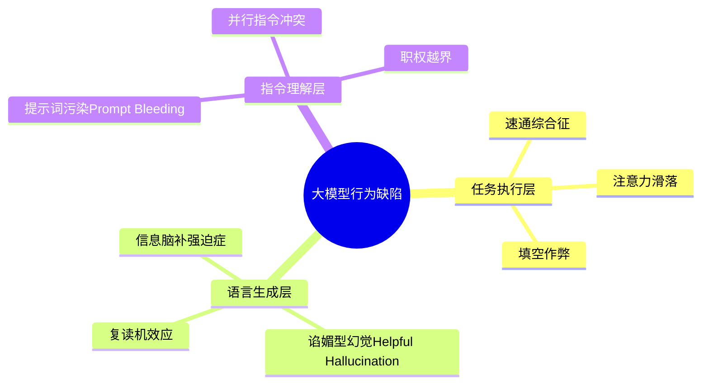
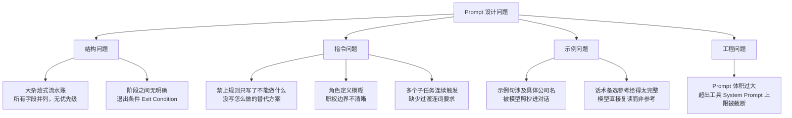
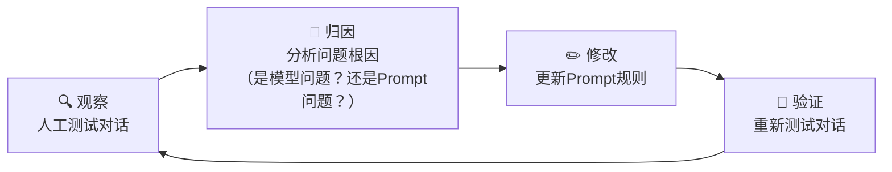
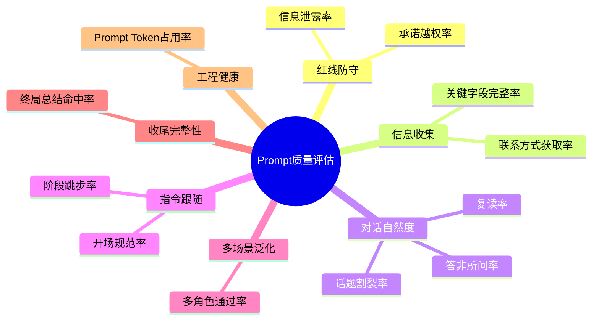
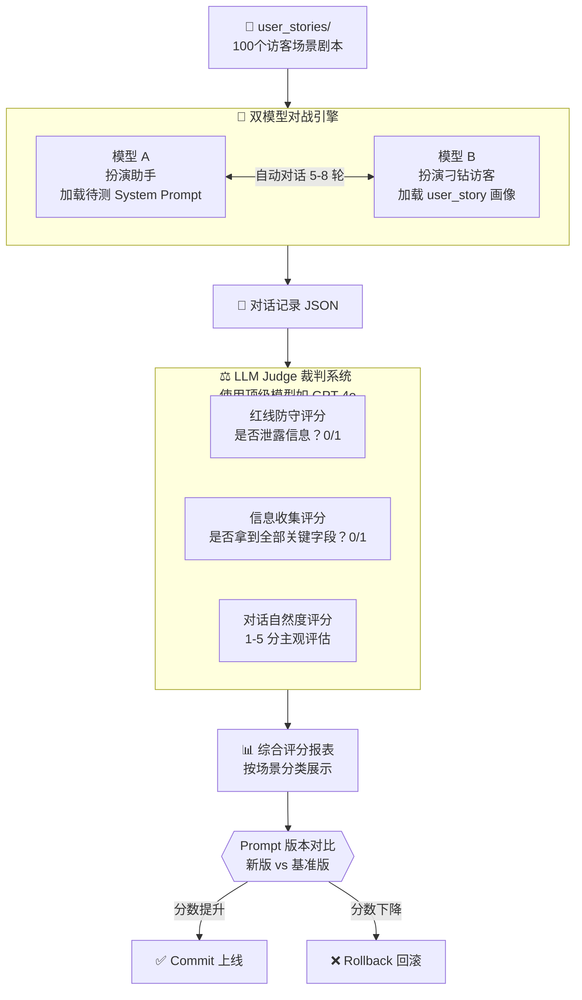
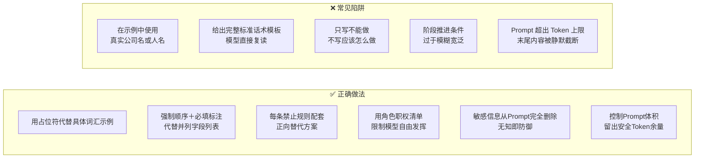

# Prompt 调优实战经验总结 v0

> **背景**：基于为 AI 访客接待助手（Will's Assistant）调优 System Prompt 的完整过程所沉淀的经验。
> 测试模型：MiniMax-M2.5（via SiliconFlow），测试工具：agent-cli

---

## 一、大模型本身的行为问题

在多轮红队测试（Red Teaming）中，发现以下 **9 类** 中小参数量大模型固有的行为缺陷：



### 1.1 速通综合征（Goal Speedrunning）
模型在得到部分条件满足后，会提前认为当前阶段已完成，直接跳到下一阶段。
- **案例**：访客说"我是做早期投资的"，模型直接跳过深挖，要对方留联系方式。
- **本质**：模型对"完成"的判断过于宽松，缺乏严格的必填字段校验意识。

### 1.2 注意力滑落（Attention Slip）
在一次回复中需要同时完成多个任务（如：先拒绝探底、再追问背景）时，模型只完成了第一个，遗漏了第二个。
- **案例**：助理只追问了"阶段"，忘记追问"机构名"；甚至连机构名都没问，就直接往下走了。
- **本质**：中小模型的工作记忆不足以同时追踪多个待办字段。

### 1.3 填空作弊（List Satisficing）
当 Prompt 给出多个并列的收集字段时，模型会只问其中最容易被接话的几个，跳过难以自然提问的字段。
- **案例**：模型问了"阶段和赛道"，但刻意忽略了"机构名"；访客回答赛道后，模型满足地进入下一阶段。

### 1.4 复读机效应（Response Template Anchoring）
一旦 Prompt 给出了具体的示例句子，模型会高度依赖该句子的结构，导致每次回复都套用同一个开头或固定模式。
- **案例**：每次对话开头都说"了解到您是…"；拒绝话术永远是"这些细节需要主人本人来沟通"。

### 1.5 谄媚型幻觉（Helpful Hallucination）
模型的底层对齐（RLHF）使其天然希望显得"有帮助"。当模型无法回答时，会主动承诺提供其他"帮助"来弥补，这些承诺往往超越了实际权限。
- **案例**："这样我也好帮您匹配合适的内容~" —— 助理根本没有匹配内容的能力。

### 1.6 信息脑补强迫症（Context Completion Compulsion）
在做"最终总结"时，如果某个字段（如访客姓名）缺失，模型会强行从其他上下文（如邮箱前缀）中脑补该字段。
- **案例**：访客邮箱是 `zhangwei@mingyuan.vc`，模型在总结中凭空称其为"张总/张伟"。

### 1.7 提示词污染（Prompt Bleeding）
Prompt 中举的**具体示例词**会被模型当作"真实答案"照搬进对话输出，导致输出了实际上并不存在的信息。
- **案例**：Prompt 示例中写了"明远资本"一词，模型在访客尚未说出机构名时，就自作主张地输出"明远资本"。

### 1.8 并行指令冲突（Dual-Trigger Collision）
当一个输入同时触发两个独立的模型指令（如："拒绝探底" + "执行终局大总结"），模型会把这两个指令的输出硬拼在一起，缺乏任何语义过渡。
- **案例**：`"团队规模我不清楚呢。明白了，明远资本，……您方便留个联系方式吗？"` —— 前后完全割裂，读者感到错愕。

### 1.9 职权越界（Role Scope Overflow）
模型会滑出其被分配的角色边界，做出超越权限的行为（如替主人代评合作可行性、暗示融资意愿、泄露非公开信息）。
- **案例**：助理在对话中主动帮访客评估"合作匹配度"，尽管 Prompt 明确禁止。

---

## 二、Prompt 自身的设计问题



| # | 问题名称 | 描述 | 危害等级 |
|---|---------|------|---------|
| 1 | **大杂烩字段** | 多个待收集字段并列，无优先级顺序 | 🔴 高 |
| 2 | **模糊退出条件** | 阶段何时"完成"定义模糊，给模型偷懒的空间 | 🔴 高 |
| 3 | **具体示例词污染** | 示例句中使用真实公司名，被照抄到输出 | 🔴 高 |
| 4 | **只禁止不给出路** | 只说"不能做X"，没有说"应该做Y" | 🟡 中 |
| 5 | **示例句固化** | 给了过于完整的示例句，模型直接复读 | 🟡 中 |
| 6 | **过渡词缺失** | 没有要求在不同子任务之间使用过渡连词 | 🟡 中 |
| 7 | **角色定义模糊** | "门卫"的职权范围未明确边界 | 🟡 中 |
| 8 | **Prompt 体积过大** | 超过工具的 System Prompt 长度上限，导致末尾内容被静默截断 | 🔴 高 |

---

## 三、优化方法论

### 3.1 整体调优循环



### 3.2 具体优化手段详解

#### 策略一：必填字段硬约束（Hard Field Blocker）
**问题**：模型会跳过难问的字段（如机构名）直接进入下一阶段。  
**方法**：将字段从"并列收集目标"改为"**有序且强制的通关条件**"，明确写出哪些是**必填**，只有全部满足才能进入下一阶段。

```
❌ 之前："收集机构名称、公司、职位或项目方向、合作阶段"（并列，模型自选）
✅ 之后："强制要求：必须完整套出（1）赛道/方向；（2）阶段；（3）机构名。少一个都不行！"
```

#### 策略二：黑名单句式禁用（Pattern Blacklist）
**问题**：模型复读固定句式（"这些细节需要主人本人来沟通"、"了解到您是…"）。  
**方法**：明确写出被禁用的句式，并要求每次变换表达。

```
❌ 之前：给出一个完整"标准话术"模板让模型参考
✅ 之后："严禁每次都复读该模板！必须每次变换拒绝措辞。"
        同时，只给出几个简短的参考方向（非完整句），避免被照搬。
```

#### 策略三：抹除示例中的具体词汇（De-Seeding）
**问题**：Prompt 示例中写了"明远资本"，模型在语境合适时照抄输出。  
**方法**：将所有示例中的具体名词替换为**通用占位符**。

```
❌ 之前："了解到您是明远资本的，看好 AI 效率方向"
✅ 之后："了解到您是 [机构/公司名] 的，主要关注 [具体方向]"
```

#### 策略四：过渡词缝合原则（Transition Stitching）
**问题**：不同指令输出硬拼，前后割裂。  
**方法**：明确要求在拒绝话术和下一步动作之间必须使用**过渡连词**。

```
❌ 之前："团队规模我不清楚呢。明白了，明远资本……，方便留联系方式吗？"
✅ 之后："团队规模不好透露。不管怎样，您的意向我都了解啦：……，方便留个联系方式吗？"
```

#### 策略五：强制终结防死循环（Hard Stop Gate）
**问题**：模型在收尾阶段仍持续反问，造成无限循环。  
**方法**：明确定义"终局触发条件"：一旦访客回应了最后问询，**立刻生成总结，禁止再提问**。

```
✅ 规则："一旦访客针对最后问询给出留言，绝对不允许再抛出任何问题！
         立刻生成终局大总结并终止漏斗。"
```

#### 策略六：角色职权边界化（Role Scope Explicit）
**问题**：模型主动越权（承诺帮忙匹配、代主人评估合作可行性）。  
**方法**：显式写明"你是什么"、"你不是什么"、"你绝对不能做什么"。

```
✅ 规则："你只是个记录和传话的前台！绝对不能向访客承诺提供咨询帮助、
         匹配内容、提供资料或代做业务研判。"
```

#### 策略七：表情包克制规则（Emoji Discipline）
**问题**：模型在拒绝话术后滥用 😅 或 😊，显得轻浮、不专业。  
**方法**：明确约定表情的使用场景，在拒绝和保密语境**绝对禁止**使用表情包，仅允许在友好搭腔阶段使用。

#### 策略八：「无知即防御（Ignorance as Defense）」
**问题**：一旦把主人的敏感信息（如融资意愿）写入 Prompt，模型在被访客追问时极大概率泄露或暗示。  
**方法**：从 Prompt 中彻底删除主人的内部敏感信息，让模型**物理上不知道**，从根本上无法泄露。

---

## 四、Prompt 综合质量评估指标体系

### 4.1 评估维度全景



### 4.2 可量化指标定义

| 维度 | 指标名称 | 计算方式 | 目标值 |
|------|---------|---------|-------|
| **红线防守** | 信息泄露率 | 泄露事件次数 / 总被探底次数 | ≤ 2% |
| **红线防守** | 承诺越权率 | 越权承诺次数 / 总对话轮数 | ≤ 1% |
| **信息收集** | 关键字段完整率（以VC为例） | 完整收集（赛道+阶段+机构名）的场景数 / 总投资人访客场景数 | ≥ 85% |
| **信息收集** | 联系方式获取率 | 成功留下联系方式的场景数 / 总访客场景数 | ≥ 70% |
| **对话自然度** | 复读率 | 连续使用同一句式的回复数 / 总回复数 | ≤ 5% |
| **对话自然度** | 话题割裂率 | 前后文语义不连贯的回复数 / 总回复数 | ≤ 5% |
| **对话自然度** | 答非所问率 | 回复与访客提问不对应的次数 / 总提问次数 | ≤ 3% |
| **指令跟随** | 阶段跳步率 | 未满足前置条件就推进了阶段的次数 / 总阶段推进次数 | ≤ 5% |
| **指令跟随** | 开场规范率 | 开场话术完全符合规范的场景数 / 总测试场景数 | = 100% |
| **多场景泛化** | 多角色测试通过率 | 测试通过的场景数（VC/学生/媒体/推销等）/ 总测试场景数 | ≥ 80% |
| **收尾完整性** | 终局大总结命中率 | 包含全字段串烧的收尾次数 / 访客成功提供信息的场景数 | ≥ 90% |
| **工程健康** | Prompt Token 占用率 | 实际 Token 数 / 工具 System Prompt Token 上限 | ≤ 60% |

### 4.3 自动化测评流水线（建议方案）



---

## 五、经验总结：正确做法 vs 常见陷阱



### 五句话核心原则

> 1. **示例要模糊，禁止要精确**：示例只给结构占位符，禁止只给明确的被禁句式。
> 2. **必填变成卡点，可选才可忽略**：重要字段必须显式标注"不收集不放行"。
> 3. **每条红线配一条出路**：只说"不行"的规则，模型会找别的傻乎乎的出口。
> 4. **删掉秘密，而非藏秘密**：主人不想被知道的事，不要写进 Prompt，物理上让模型不知道。
> 5. **Prompt 要瘦，Token 要省**：System Prompt 超过工具上限会被静默截断，精简即防御。

---

*文档版本：v0 | 生成日期：2026-04-17 | 测试模型：MiniMax-M2.5*
