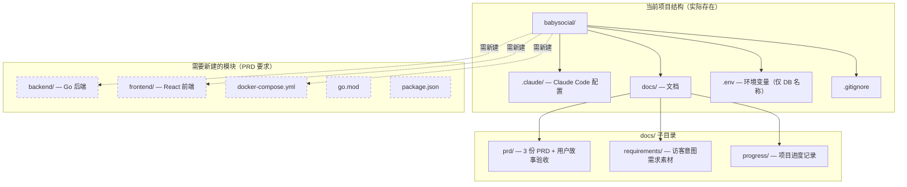

# BabySocial 全局现状分析报告

> **关联 PRD**：`docs/prd/PRD-user-auth-20260405.md`、`docs/prd/PRD-user-profile-20260405.md`、`docs/prd/PRD-visitor-intent-20260405.md`
> **分析时间**：2026-04-06
> **分析者**：code-scout Agent

---

## 目录

- [需求覆盖矩阵](#需求覆盖矩阵)
- [架构现状](#架构现状)
  - [模块结构图](#模块结构图)
  - [技术栈现状](#技术栈现状)
  - [可复用基础设施](#可复用基础设施)
- [已有接口分析](#已有接口分析)
- [代码实现分析](#代码实现分析)
  - [后端代码](#后端代码)
  - [前端代码](#前端代码)
- [第三方中间件](#第三方中间件)
- [第三方服务](#第三方服务)
- [风险与注意事项](#风险与注意事项)
- [改造建议摘要](#改造建议摘要)

---

## 需求覆盖矩阵

### PRD-USER-AUTH-001（用户注册与登录）

| PRD 需求点 | 覆盖状态 | 关联代码/文档 | 说明 |
|-----------|----------|--------------|------|
| 邮箱注册流程（格式校验、验证码、密码设置） | ❌ 未实现 | 无 | 后端、前端代码目录均不存在，需从零构建 |
| 人机校验（滑动图片验证） | ❌ 未实现 | 无 | 需选型并实现 `HumanVerifier` 接口 |
| 密码登录（含"记住我"） | ❌ 未实现 | 无 | 需实现 JWT Access Token + Refresh Token 机制 |
| 用户角色（RBAC） | ❌ 未实现 | 无 | 需设计 RBAC 中间件 |
| 账号锁定（连续失败 5 次） | ❌ 未实现 | 无 | 需实现登录失败计数和时限锁定逻辑 |
| 邮箱验证码发送 | ❌ 未实现 | 无 | 邮件服务商尚未选定（待确认 Q-01） |
| 数据库表（users、email_verification_codes、refresh_tokens） | ❌ 未实现 | 无 | PostgreSQL 已在 MCP 中配置连接，但无迁移文件 |

### PRD-USER-PROFILE-001（个人主页展示）

| PRD 需求点 | 覆盖状态 | 关联代码/文档 | 说明 |
|-----------|----------|--------------|------|
| 个人主页展示（头像、昵称、简介等） | ❌ 未实现 | 无 | 前端页面和后端 API 均需从零构建 |
| 个人资料编辑 | ❌ 未实现 | 无 | 需实现编辑页面和 PATCH API |
| 注册后引导填写资料（分步表单） | ❌ 未实现 | 无 | 前端分步表单组件需从零构建 |
| 资料完善度评分 | ❌ 未实现 | 无 | 后端计算 + 前端展示 |
| 个人短链功能 | ❌ 未实现 | 无 | 短链生成算法 + 路由解析 |
| AI 助理聊天界面 | ❌ 未实现 | 无 | 前端聊天 UI + 后端 LLM 代理 |
| Profile 文件上传与摘要生成 | ❌ 未实现 | 无 | 文件存储 + LLM 异步摘要任务 |
| AI 助理接待设置（引导式填写） | ❌ 未实现 | 无 | 结构化设置表单 + 数据库存储 |
| 数据库表（user_profiles、user_short_links、user_profile_files、ai_chat_sessions、ai_chat_messages） | ❌ 未实现 | 无 | 需创建迁移文件 |

### PRD-VISITOR-INTENT-001（访客意图识别聊天助手）

| PRD 需求点 | 覆盖状态 | 关联代码/文档 | 说明 |
|-----------|----------|--------------|------|
| AI 助理对话策略（skill_base.md 落地） | ⚠️ 部分实现 | `docs/requirements/visitor_intent/skill_base.md` | 策略文档已编写，但代码层尚未实现 |
| 意图识别模块（LLM 实现） | ❌ 未实现 | `docs/requirements/visitor_intent/intent_category.md` | 意图分类文档已定义，代码需从零构建 |
| 对话状态机（S0-S6 + SE） | ❌ 未实现 | 无 | 状态机逻辑需在后端实现 |
| 会话管理（主人视角） | ❌ 未实现 | 无 | 会话列表、未读状态、详情查看 |
| 对话信息提取（结构化字段） | ❌ 未实现 | 无 | LLM 异步提取 + 结构化存储 |
| 用户故事场景覆盖 | ⚠️ 部分实现 | `docs/requirements/visitor_intent/user_stories/`（100 个场景） | 用户故事已编写，验收标准文档已完成 |
| 数据库补充字段和新表（ai_chat_extracted_info） | ❌ 未实现 | 无 | 需追加迁移 |

---

## 架构现状

### 模块结构图

### 技术栈现状

| 层次 | 技术选型 | 版本 | 初始化状态 | 用途 |
|------|---------|------|-----------|------|
| 后端框架 | Go | 未初始化 | ❌ 无 `go.mod` | REST API 服务 |
| 前端框架 | React + TypeScript | 未初始化 | ❌ 无 `package.json` | 用户界面 |
| 数据库 | PostgreSQL | 未确认 | ⚠️ MCP 配置已就绪，无迁移文件 | 主数据库 |
| 容器化 | Docker | 未初始化 | ❌ 无 `docker-compose.yml` | PostgreSQL 运行环境 |
| LLM | qwen-plus（通义千问） | 未集成 | ❌ 无 SDK 依赖 | AI 助理对话、意图识别、信息提取 |
| 缓存 | Redis | 未规划 | ❌ 未配置 | 验证码缓存、登录失败计数、频率限制 |
| 邮件服务 | 未选型 | — | ❌ 未配置 | 邮箱验证码发送 |
| 文件存储 | PostgreSQL BYTEA（MVP） | — | ❌ 未实现 | 头像、Profile 文件存储 |

### 可复用基础设施

| 基础设施 | 位置 | 描述 | 复用建议 |
|----------|------|------|----------|
| Claude Code 配置体系 | `.claude/` | Agent 定义、命令、模板、规则、技能、Hook 脚本 | 可直接复用，驱动后续开发流程 |
| PostgreSQL MCP 连接 | `.claude/.mcp.json` | 通过 MCP 协议连接本地 PostgreSQL（`localhost:5432/babysocial`） | 可直接复用，数据库操作已有通道 |
| GitHub MCP 集成 | `.claude/.mcp.json` | 通过 `gh auth token` 连接 GitHub API | 可直接复用 |
| 安全检查 Hook | `.claude/scripts/safety-check.sh` + `.claude/settings.json` | Bash 命令执行前的安全检查 PreToolUse Hook | 可直接复用 |
| 环境变量机制 | `.env` + `.gitignore` | `.env` 文件已配置数据库名，`.gitignore` 已排除 `.env` | 可直接复用，需追加更多环境变量 |
| 访客意图需求素材 | `docs/requirements/visitor_intent/` | `skill_base.md`、`owner_profile.md`、`intent_category.md`、100 个用户故事 | 可直接复用，是 AI 助理 prompt 工程的核心输入 |
| 项目进度记录 | `docs/progress/2026_04_05.md` | 已有进度记录模式 | 可直接复用 |

---

## 已有接口分析

### 可复用接口

当前项目无任何已实现的 API 接口。`backend/` 目录不存在，没有 handler、路由、中间件等代码。

| 接口 | 方法 | 路径 | 当前用途 | 与新需求关系 |
|------|------|------|----------|-------------|
| （无） | — | — | — | — |

### 接口风格与模式

以下模式需要在架构设计阶段确定：

- **认证方式**：PRD 规定 JWT（Access Token + Refresh Token），尚未实现
- **错误处理**：未确定统一错误响应格式
- **分页模式**：未确定（会话列表等需要分页）
- **响应格式**：未确定（建议采用统一的 JSON envelope 格式）

---

## 代码实现分析

### 后端代码

`backend/` 目录不存在。需要从零构建以下全部内容：

#### 领域层（domain）

| 领域对象 | 类型 | 文件 | 与新需求关系 |
|----------|------|------|-------------|
| User | Aggregate Root | 需新建 `backend/internal/domain/user/` | AUTH 核心，Profile 依赖 |
| EmailVerificationCode | Entity | 需新建 | AUTH 注册流程 |
| RefreshToken | Entity | 需新建 | AUTH 登录/续期 |
| UserProfile | Aggregate Root | 需新建 `backend/internal/domain/profile/` | Profile 核心 |
| ShortLink | Value Object | 需新建 | Profile 短链 |
| ProfileFile | Entity | 需新建 | Profile 文件上传 |
| ChatSession | Aggregate Root | 需新建 `backend/internal/domain/chat/` | AI 助理会话 |
| ChatMessage | Entity | 需新建 | AI 助理消息 |
| ExtractedInfo | Entity | 需新建 | 访客信息提取 |
| IntentType | Value Object (Enum) | 需新建 | 意图识别分类 |
| DialogState | Value Object (Enum) | 需新建 | 对话状态机 |

#### 应用层（application）

| 服务 | 文件 | 核心方法 | 与新需求关系 |
|------|------|----------|-------------|
| AuthService | 需新建 | Register, Login, RefreshToken, VerifyEmail | AUTH 核心 |
| ProfileService | 需新建 | GetProfile, UpdateProfile, CalculateCompletionScore | Profile 核心 |
| ShortLinkService | 需新建 | GenerateShortLink, ResolveShortLink | Profile 短链 |
| FileService | 需新建 | UploadProfileFile, GenerateSummary | Profile 文件 |
| ChatService | 需新建 | CreateSession, SendMessage, GetSessionList | AI 助理核心 |
| IntentService | 需新建 | ClassifyIntent, ExtractInfo | 访客意图识别 |
| HospitalityService | 需新建 | GetSettings, UpdateSettings | 接待设置 |

#### 基础设施层（infrastructure）

| 组件 | 文件 | 用途 | 与新需求关系 |
|------|------|------|-------------|
| PostgreSQL 连接池 | 需新建 | 数据库连接管理 | 全局基础设施 |
| UserRepository | 需新建 | 用户数据持久化 | AUTH |
| ProfileRepository | 需新建 | 资料数据持久化 | Profile |
| ChatRepository | 需新建 | 会话/消息持久化 | AI 助理 |
| EmailSender | 需新建 | 邮件发送（验证码） | AUTH |
| AIProvider（qwen-plus） | 需新建 | LLM API 调用代理 | AI 助理 |
| IntentClassifier（LLM） | 需新建 | 意图分类 LLM 实现 | 访客意图 |
| FileStorage（PostgreSQL BYTEA） | 需新建 | 文件存储 | Profile |
| HumanVerifier（滑动验证） | 需新建 | 人机校验 | AUTH |

#### 代码风格与惯例

- **错误处理模式**：未确定，PRD 要求不得用 `_` 忽略错误
- **依赖注入方式**：未确定，建议构造函数注入
- **测试覆盖情况**：无任何测试代码，需从 TDD 开始

### 前端代码

`frontend/` 目录不存在。需要从零构建以下全部内容：

#### 组件清单

| 组件 | 类型 | 文件 | 与新需求关系 |
|------|------|------|-------------|
| RegisterPage | 页面 | 需新建 `frontend/src/pages/` | AUTH 注册 |
| LoginPage | 页面 | 需新建 | AUTH 登录 |
| ProfilePage | 页面 | 需新建 | Profile 展示 |
| ProfileEditPage | 页面 | 需新建 | Profile 编辑 |
| OnboardingPage | 页面 | 需新建 | 注册引导 |
| AIChatPage | 页面 | 需新建 | AI 助理聊天 |
| SessionListPage | 页面 | 需新建 | 会话管理 |
| HospitalitySettingsPage | 页面 | 需新建 | 接待设置 |
| SliderCaptcha | 通用 | 需新建 `frontend/src/components/` | 人机校验 |
| ChatBubble | 通用 | 需新建 | 聊天气泡 |
| StepForm | 通用 | 需新建 | 分步表单 |
| CompletionBar | 通用 | 需新建 | 完善度进度条 |
| TagSelector | 通用 | 需新建 | 多选标签（专长/兴趣/喜好） |
| ImageUploader | 通用 | 需新建 | 头像上传 |

#### 状态管理

| Store | 文件 | 管理的状态 | 与新需求关系 |
|-------|------|-----------|-------------|
| authStore | 需新建 | JWT token、用户信息、登录状态 | AUTH 全局 |
| profileStore | 需新建 | 个人资料、完善度分数 | Profile |
| chatStore | 需新建 | 对话消息、会话状态 | AI 助理 |
| sessionStore | 需新建 | 会话列表、未读计数 | 会话管理 |

#### API 调用层

| 服务模块 | 文件 | 封装的接口 | 与新需求关系 |
|----------|------|-----------|-------------|
| authApi | 需新建 `frontend/src/services/` | register, login, refreshToken, sendVerificationCode | AUTH |
| profileApi | 需新建 | getProfile, updateProfile, uploadAvatar, uploadProfileFile | Profile |
| chatApi | 需新建 | sendMessage, getSessionList, getSessionDetail | AI 助理 |
| shortLinkApi | 需新建 | resolveShortLink | 短链解析 |

---

## 第三方中间件

| 中间件 | 用途 | 配置位置 | 当前使用方式 | 新需求影响 |
|--------|------|----------|-------------|-----------|
| PostgreSQL | 主数据库 | `.claude/.mcp.json`、`.env` | MCP 连接配置就绪（`localhost:5432/babysocial`），无实际数据表 | 需创建全部数据表（users、email_verification_codes、refresh_tokens、user_profiles、user_short_links、user_profile_files、ai_chat_sessions、ai_chat_messages、ai_chat_extracted_info） |
| Redis | 验证码缓存、登录失败计数、频率限制、匿名访客 session token | 无 | 未配置、未安装 | PRD 中多处需要临时数据存储和频率限制：验证码冷却（60s）、IP 频率限制、登录失败计数、匿名 session token。建议引入 Redis |
| Docker / Docker Compose | PostgreSQL + Redis 容器运行 | 无 | 未配置 | 需创建 `docker-compose.yml`，至少包含 PostgreSQL 和 Redis 服务 |

---

## 第三方服务

| 服务 | 提供商 | 用途 | 抽象层 | 新需求影响 |
|------|--------|------|--------|-----------|
| LLM（AI 对话） | 通义千问（qwen-plus） | AI 助理对话生成、摘要生成 | 需新建 `AIProvider` 接口 | 需新增：PRD 明确要求 qwen-plus，备选 Gemini 系列 |
| LLM（意图识别） | 通义千问（qwen-plus） | 访客意图分类 | 需新建 `IntentClassifier` 接口 | 需新增：与对话生成共用同一 LLM 提供商，但为独立请求 |
| LLM（信息提取） | 通义千问（qwen-plus） | 对话结构化信息提取 | 可复用 `AIProvider` 接口 | 需新增 |
| 邮件服务 | 未选型（待确认：SendGrid / AWS SES / 自建 SMTP） | 邮箱验证码发送 | 需新建 `EmailSender` 接口 | 需新增：PRD 待确认事项 Q-01 |
| 人机校验 | 未选型 | 滑动图片验证 | 需新建 `HumanVerifier` 接口 | 需新增：PRD 要求 MVP 实现滑动图片验证 |
| 文件存储 | PostgreSQL BYTEA（MVP） / 后续 OSS/S3 | 头像、Profile 文件 | 需新建 `FileStorage` 接口 | 需新增：MVP 阶段存数据库，抽象层需支持后续切换 |

---

## 风险与注意事项

### 高风险

| 风险项 | 影响范围 | 详细描述 | 建议处理方式 |
|--------|---------|----------|-------------|
| 项目从零开始，无任何代码基础 | 全部 3 个 PRD | `backend/` 和 `frontend/` 目录均不存在，`go.mod`、`package.json` 等均未初始化。所有业务功能需要完全从零构建，包括项目脚手架、基础设施层、领域层、接口层 | 优先执行项目初始化：创建 Go 模块、React 项目、Docker Compose、数据库迁移框架。建议架构师先产出完整的技术方案后再开始编码 |
| 邮件服务商未选型 | AUTH 注册流程 | PRD Q-01 标注邮件服务商尚未确定（SendGrid / AWS SES / 自建 SMTP）。邮箱验证码是注册的核心环节，此依赖不确定将阻塞注册功能开发 | 尽快决策邮件服务商。建议 MVP 阶段使用 SendGrid 免费层（100 封/天），通过 `EmailSender` 接口抽象，后续可替换 |
| LLM API Key 管理和成本控制 | AI 助理所有功能 | qwen-plus 的 API Key 需要申请和配置；AI 助理涉及 3 类 LLM 调用（对话生成、意图识别、信息提取），调用频率可能较高，成本需评估 | 通过环境变量管理 API Key；实现调用频率监控和预算告警；意图识别和信息提取采用异步方式，避免阻塞对话 |
| 测试阶段邮箱可重复注册的开关机制 | AUTH 数据模型 | PRD 3.1.3 明确要求测试阶段允许同一邮箱重复注册，正式上线前切换为唯一约束。此配置开关必须在首次建表时就设计好，避免后续数据迁移困难 | 建表时不加 UNIQUE 约束，通过应用层配置开关控制；正式上线前通过迁移脚本添加约束（需先清理重复数据） |

### 中风险

| 风险项 | 影响范围 | 详细描述 | 建议处理方式 |
|--------|---------|----------|-------------|
| Redis 未规划但多处需要 | AUTH（验证码、频率限制、账号锁定）、AI 助理（匿名 session token） | PRD 多处涉及临时数据存储场景（验证码 60s 冷却、IP 频率限制 20 次/小时、登录失败 5 次锁定 15 分钟、匿名访客 session token），这些场景天然适合 Redis，但项目中未提及 Redis | 架构师需决策是否引入 Redis。若引入，需加入 `docker-compose.yml`；若不引入，需评估 PostgreSQL 能否承担这些短时高频读写场景 |
| 人机校验组件选型 | AUTH 注册流程 | PRD 要求"滑动图片验证"作为 MVP 人机校验方式，但未指定具体方案。需选择前端组件库和后端校验实现 | 前端可考虑 `react-slider-captcha` 或类似库；后端实现 `HumanVerifier` 接口。如果使用第三方服务（极验、数美），需评估成本和注册流程 |
| 多份 PRD 之间的数据表依赖关系 | 数据库迁移 | 3 份 PRD 定义了 9+ 张数据表，且存在依赖关系（如 `ai_chat_sessions` 在 Profile PRD 定义基础字段，Visitor Intent PRD 追加字段）。迁移脚本需要正确的执行顺序 | 架构设计阶段需输出完整的数据库 ER 图，明确表间依赖关系和迁移顺序 |
| AI 助理 prompt 工程复杂度高 | 访客意图识别 | `skill_base.md` 包含复杂的三层优先级规则、红线列表、各类访客处理规则、对话状态机。将这些逻辑转化为可靠的 system prompt 需要大量调试和测试 | 建议将 prompt 组装逻辑模块化（红线层、流程层、场景层），独立测试每一层。初期可手动测试 100 个用户故事场景的覆盖情况 |
| 匿名访客 session 与登录用户的会话隔离 | AI 助理会话 | PRD 定义了匿名访客和登录用户两种访客类型，会话历史规则不同。匿名访客使用 sessionStorage token，登录用户关联 user_id。两种模式需要不同的鉴权和数据管理逻辑 | 后端会话创建时需区分两种身份类型，session token 管理建议使用 Redis |

### 低风险

| 风险项 | 影响范围 | 详细描述 | 建议处理方式 |
|--------|---------|----------|-------------|
| Profile 文件存储在 PostgreSQL BYTEA | Profile 文件上传 | MVP 阶段将文件存储在数据库中（BYTEA 类型），文件上限 1MB。对于 MVP 的量级可以承受，但随着用户增长会成为瓶颈 | 当前可接受。通过 `FileStorage` 接口抽象，后续迭代切换为 OSS/S3 |
| 前端 CSS 方案未确定 | 前端全局 | PRD 和规则中提及 CSS Modules 或 styled-components，但未做最终选型 | 架构设计阶段确定，建议统一使用 CSS Modules 或 Tailwind CSS |
| 管理员账号初始创建方式未确定 | AUTH 角色管理 | PRD Q-03 标注管理员账号创建方式待确认（数据库直写 / 运营后台注册） | MVP 阶段可通过数据库迁移脚本创建初始管理员，后续补充管理后台 |
| 头像自动压缩为 WebP | Profile 编辑 | PRD 要求后端自动压缩头像为 WebP 格式，需要图像处理库 | Go 生态有成熟的图像处理库（如 `disintegration/imaging`），风险可控 |
| HTTPS 证书部署 | 全局安全 | PRD 详细说明了 Let's Encrypt 证书部署方案，但这是生产环境需求，开发/测试阶段可忽略 | 开发阶段使用 HTTP，生产部署前配置 HTTPS |

---

## 改造建议摘要

### 可直接复用（无需修改）

1. **Claude Code 配置体系**（`.claude/`）— Agent 定义、命令、模板、规则、技能完善，直接驱动后续开发流程
2. **PostgreSQL MCP 连接**（`.claude/.mcp.json`）— 数据库连接通道已就绪
3. **GitHub MCP 集成**（`.claude/.mcp.json`）— 代码管理通道已就绪
4. **安全检查 Hook**（`.claude/settings.json` + `.claude/scripts/safety-check.sh`）
5. **环境变量机制**（`.env` + `.gitignore`）— 需追加更多变量但机制可复用
6. **访客意图需求素材**（`docs/requirements/visitor_intent/`）— `skill_base.md`、`intent_category.md`、100 个用户故事

### 需要扩展（在已有基础上增强）

1. **`.env` 文件** — 当前仅有 `BABYSOCIAL_DB_NAME`，需追加：PostgreSQL 密码、JWT 密钥、LLM API Key、邮件服务凭据、Redis 连接等
2. **`.gitignore` 文件** — 需追加 Go 和 React 项目的忽略规则（`/backend/bin/`、`/frontend/node_modules/`、`/frontend/build/` 等）

### 需要新建（全新实现）

1. **Go 后端项目**（`backend/`）：
   - 项目初始化：`go.mod`、`cmd/main.go`
   - DDD 分层目录：`internal/domain/`、`internal/application/`、`internal/infrastructure/`、`internal/interfaces/`
   - 公共包：`pkg/`（错误处理、日志、配置、中间件等）
   - 数据库迁移：`backend/migrations/`（9+ 张表）

2. **React 前端项目**（`frontend/`）：
   - 项目初始化：`create-react-app` 或 Vite + TypeScript
   - 8+ 页面组件、6+ 通用组件
   - 状态管理、API 调用层、类型定义

3. **Docker Compose**（`docker-compose.yml`）：
   - PostgreSQL 服务（端口 5432）
   - Redis 服务（如选择引入）

4. **架构设计文档**（`docs/architecture/`）：
   - 领域模型设计
   - API 契约文档
   - 数据库 ER 图
   - 前端架构设计

5. **第三方服务集成**：
   - LLM 提供商（qwen-plus）SDK 集成
   - 邮件服务集成
   - 人机校验组件集成

### 需要重构（已有实现不满足要求）

当前无已有代码实现，不存在重构需求。所有功能为全新构建。
